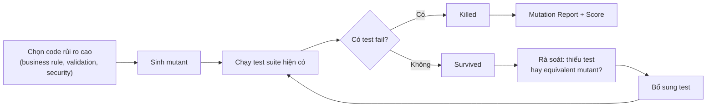

# Báo cáo: Mutation Testing & Test Effectiveness

## Thông tin nhóm

| MSSV     | Họ và tên         | Đóng góp (%) |
| -------- | ----------------- | ------------ |
| 23127539 | Nguyễn Thanh Tiến |              |
| 23127296 | Nguyễn Thành Luân |              |
| 23127404 | Lê Tuấn Lộc       |              |
| 23127061 | Trương Lý Khải    |              |
| 23127330 | Ngô An Bình       |              |

**GitHub Repository**: [mutation-testing & test effectiveness](https://github.com/NguyenThanhTien539/mutation-testing)

## Đặt vấn đề

Code Coverage là một chỉ số phổ biến để đánh giá mức độ bao phủ của bộ kiểm thử, tuy nhiên nó chỉ cho biết mã nguồn đã được thực thi hay chưa mà không phản ánh liệu kết quả có được kiểm chứng đầy đủ hay không. Một test suite có thể đạt Code Coverage rất cao, thậm chí 100%, nhưng vẫn không phát hiện được lỗi logic nếu thiếu các assertion hoặc các trường hợp kiểm thử phù hợp. Để giải quyết hạn chế này, Mutation Testing được đề xuất như một phương pháp đánh giá hiệu quả của bộ kiểm thử bằng cách cố ý tạo ra các thay đổi nhỏ trong mã nguồn và kiểm tra xem test hiện tại có phát hiện được các thay đổi đó hay không.

## 1. Mutation Testing là gì

Mutation Testing tạo ra các phiên bản code bị thay đổi nhỏ, có chủ đích, gọi là **mutant** (ví dụ đổi `>=` thành `>`), rồi chạy lại test suite hiện có trên từng mutant:

- Nếu có test **fail** → mutant bị **killed** (test tốt).
- Nếu toàn bộ test **pass** → mutant **survived** (test suite có lỗ hổng: thiếu assertion, thiếu boundary/negative case).

Mục đích chính không phải tìm bug trong production code, mà là **đo độ mạnh của chính bộ test** ("test the tests").

## 2. Quy trình



1. Chọn source code quan trọng (business rule, validation, security).
2. Sinh mutant bằng các mutation operators.
3. Chạy test suite hiện có trên từng mutant.
4. Phân loại: killed / survived / no coverage / timeout.
5. Rà soát mutant survived → xác định là thiếu test hay là equivalent mutant.
6. Bổ sung test, chạy lại, tính mutation score.

## 3. Các Toán tử Đột biến (Mutation Operators)

Các **toán tử đột biến (Mutation Operators)** là các quy tắc được công cụ Mutation Testing sử dụng để tạo ra những phiên bản mã nguồn đã được sửa đổi có chủ đích, gọi là **mutants**. Mỗi toán tử mô phỏng một loại lỗi lập trình phổ biến nhằm đánh giá khả năng của bộ kiểm thử trong việc phát hiện các lỗi này.

Bảng dưới đây trình bày các nhóm toán tử đột biến phổ biến cùng với những loại lỗ hổng kiểm thử mà chúng thường giúp phát hiện.

| **Nhóm Toán tử**                   | **Ví dụ Đột biến**                                             | **Lỗ hổng Kiểm thử Thường Phát hiện**                                                                                                        |
| ---------------------------------- | -------------------------------------------------------------- | -------------------------------------------------------------------------------------------------------------------------------------------- |
| **Số học**                         | `+` → `-`<br>`>=` → `>`<br>`==` → `!=`                         | Thiếu kiểm thử giá trị biên (_boundary testing_) hoặc thiếu assertion kiểm tra chính xác giá trị đầu ra.                                     |
| **Luận lý**                        | `&&` → `\|\|`<br>`\|\|` → `&&`                                 | Thiếu các trường hợp kiểm thử kết hợp điều kiện (_combination testing_) hoặc chưa bao phủ đầy đủ các nhánh quyết định (_decision branches_). |
| **Giá trị trả về / Boolean**       | `true` → `false`<br>`return x` → `return null` hoặc `return 0` | Assertion chưa đủ mạnh để xác minh giá trị trả về hoặc chưa kiểm thử các trường hợp ngoại lệ và giá trị mặc định.                            |
| **Loại bỏ câu lệnh / Lời gọi hàm** | Xóa `sendEmail()`<br>Xóa khối `else`                           | Thiếu kiểm tra các **side effects** (ví dụ: gửi email, ghi log, cập nhật cơ sở dữ liệu) hoặc chưa xác minh đầy đủ hành vi của hệ thống.      |
| **Hằng số / Tập hợp / Chuỗi**      | `0.2` → `0.05`<br>`[1,2]` → `[]`<br>`"admin"` → `""`           | Chưa kiểm tra các hằng số nghiệp vụ quan trọng, chưa xử lý trường hợp tập hợp rỗng hoặc chưa xác minh tính đúng đắn của dữ liệu chuỗi.       |
| **Biểu thức chính quy**            | Thay đổi hoặc nới lỏng biểu thức Regex                         | Thiếu các trường hợp _negative testing_ để kiểm tra dữ liệu đầu vào không hợp lệ hoặc sai định dạng.                                         |

> **Nhận xét:** Mỗi nhóm toán tử đột biến đại diện cho một nhóm lỗi lập trình phổ biến. Nếu một mutant vẫn survive, điều đó cho thấy bộ kiểm thử còn thiếu trường hợp kiểm thử hoặc assertion phù hợp. Vì vậy, Mutation Testing giúp xác định điểm yếu của bộ kiểm thử, trong khi Code Coverage chỉ phản ánh mức độ thực thi mã nguồn.

## 4. Điểm số Đột biến (Mutation Score)

Điểm số đột biến (Mutation Score) là một số đo định lượng phản ánh hiệu quả thực sự của bộ kiểm thử (test suite) trong việc phát hiện lỗi logic, có giá trị và độ tin cậy cao hơn so với tỷ lệ bao phủ mã (code coverage) thông thường.

Mutation Score được tính theo công thức:

$$ \text{Mutation Score} = \frac{\text{Killed} + \text{Timeout}}{\text{Total Mutants}} \times 100\% $$

### 4.1. Phân loại trạng thái của Đột biến (Mutants)

| Thuật ngữ       | Ý nghĩa và Đánh giá                                                                                                                                                                                      |
| :-------------- | :------------------------------------------------------------------------------------------------------------------------------------------------------------------------------------------------------- |
| **Killed**      | Ít nhất một test case thất bại (fail) khi chạy trên mã đột biến. Điều này chứng tỏ test case đã phát hiện thành công sự thay đổi, khẳng định độ chặt chẽ của các câu lệnh kiểm chứng (assertion).        |
| **Survived**    | Toàn bộ test case đều vượt qua (pass) dù mã nguồn đã bị thay đổi logic. Đây là dấu hiệu cảnh báo bộ kiểm thử đang có lỗ hổng (thiếu kịch bản test hoặc assertion quá lỏng lẻo).                          |
| **Timeout**     | Mã đột biến gây ra vòng lặp vô hạn hoặc làm tăng đột biến thời gian thực thi (ví dụ: mất điều kiện dừng của vòng lặp `while`). Các công cụ tự động ngắt và tính trạng thái này tương đương với _Killed_. |
| **No Coverage** | Đột biến sinh ra ở dòng code không có bất kỳ test case nào chạy qua. Trạng thái này mặc định được đánh giá là _Survived_.                                                                                |

### 4.2. Đánh giá chất lượng Test Suite qua Mutation Score

Mutation Score là thước đo sắc bén nhất để đánh giá "sức mạnh" của bộ kiểm thử. Khác với Code Coverage (chỉ cho biết đoạn code nào được chạy qua), Mutation Score chứng minh được test suite có thực sự bắt được lỗi khi logic thay đổi hay không.

#### Mutation Score cao (ví dụ: > 80% - 90%)

- **Ý nghĩa:** Bộ kiểm thử có chất lượng rất tốt. Các kịch bản kiểm thử bao quát được hầu hết các nhánh logic và các câu lệnh `assert` được viết cực kỳ chặt chẽ, chính xác.
- **Tác động:** Mang lại sự tự tin cao độ cho đội ngũ phát triển. Lập trình viên có thể mạnh dạn tái cấu trúc (refactor) mã nguồn, thêm tính năng mới hoặc nâng cấp thư viện mà không sợ gây ra lỗi hồi quy (regression bugs). Bất kỳ thay đổi sai lệch nào cũng sẽ bị test suite phát hiện và báo đỏ ngay lập tức.

#### Mutation Score thấp

- **Ý nghĩa:** Bộ kiểm thử đang yếu và tồn tại nhiều "điểm mù". Dù Code Coverage có thể rất cao (thậm chí 100%), nhưng các test cases chỉ đơn thuần là thực thi hàm (execute) chứ không kiểm chứng kỹ lưỡng kết quả trả về hay trạng thái hệ thống (thiếu/yếu assertions).
- **Tác động:** Tạo ra cảm giác an toàn giả tạo (false sense of security). Khi có lỗi logic thực sự xảy ra hoặc có người vô tình sửa sai code, bộ kiểm thử vẫn báo "xanh" (pass), dẫn đến nguy cơ lọt lỗi nghiêm trọng ra môi trường production.
- **Giải pháp:** Cần rà soát lại các mutants đang ở trạng thái _Survived_, từ đó bổ sung thêm test cases cho các trường hợp biên (edge cases) hoặc viết lại các assertions sao cho cụ thể và khắt khe hơn.

## 5. Test Effectiveness & Assertion Testing

- **Nguyên lý nền tảng:** Kiểm thử phần mềm chỉ có thể chứng minh sự hiện diện của lỗi (presence of defects), hoàn toàn không thể chứng minh sự vắng mặt tuyệt đối của chúng (absence of defects). Do đó, chất lượng của bộ kiểm thử phụ thuộc trực tiếp vào tính khắt khe của các chiến lược kiểm chứng.
- **Vai trò cốt lõi của Assertion (Câu lệnh kiểm chứng):** Assertion đóng vai trò là các trạm kiểm soát (checkpoints) mang tính quyết định để xác nhận tính đúng đắn của hành vi hệ thống. Việc thiếu vắng assertion hoặc sử dụng assertion quá lỏng lẻo (weak assertions) là nguyên nhân phổ biến nhất khiến các mã đột biến (mutants) rơi vào trạng thái _Survived_, ngay cả khi tỷ lệ bao phủ mã (Code Coverage) đạt mức rất cao.

- **Tiêu chuẩn về Test Effectiveness:** Một bộ kiểm thử chất lượng không được phép chỉ tập trung vào các luồng xử lý lý tưởng (Happy Path). Để đạt hiệu quả cao, nó bắt buộc phải bao phủ:
  - **Trường hợp biên (Boundary conditions):** Ranh giới của các giá trị hợp lệ và không hợp lệ.
  - **Kiểm thử tiêu cực (Negative cases):** Khả năng chịu lỗi và xử lý các ngoại lệ khi nhận dữ liệu sai lệch.
  - **Tác động phụ (Side-effects):** Các thay đổi về trạng thái hệ thống bên ngoài giá trị trả về trực tiếp (ví dụ: sự thay đổi trong Database, log files, hoặc các lời gọi API bên ngoài).

## 6. Code Coverage vs Mutation Testing

Mặc dù cả hai đều là những công cụ quan trọng trong việc đánh giá chất lượng bộ kiểm thử, Code Coverage và Mutation Testing tiếp cận vấn đề từ hai góc độ hoàn toàn khác nhau. Chúng không thay thế mà mang tính bổ trợ cho nhau.

Bảng dưới đây phân tích sự khác biệt cốt lõi giữa hai phương pháp này:

| Tiêu chí Đánh giá (Criteria)         | Code Coverage                                                                                                                                              | Mutation Testing                                                                                                                                               |
| :----------------------------------- | :--------------------------------------------------------------------------------------------------------------------------------------------------------- | :------------------------------------------------------------------------------------------------------------------------------------------------------------- |
| **Bản chất Đo lường**                | **Định lượng :** Chỉ xác nhận việc một dòng lệnh, nhánh (branch) hoặc hàm có được thực thi hay không khi chạy test suite.                                  | **Định tính :** Xác nhận khả năng phát hiện lỗi thực sự (fault-revealing capability) của bộ kiểm thử khi logic bị thay đổi.                                    |
| **Vai trò trong Đảm bảo Chất lượng** | **Ngưỡng tối thiểu (Lower Bound):** Là "điều kiện cần". Chỉ ra những vùng mã nguồn _chưa_ được kiểm thử.                                                   | **Ngưỡng tối đa (Upper Bound):** Là "điều kiện đủ". Đóng vai trò là thước đo độ tin cậy và tính chặt chẽ thực sự của test suite.                               |
| **Chi phí Thực thi**                 | **Thấp & Nhanh chóng:** Ít tiêu tốn tài nguyên, tích hợp dễ dàng vào các quá trình CI/CD với thời gian phản hồi gần như tức thì.                           | **Cao & Tốn kém:** Yêu cầu sức mạnh tính toán lớn do phải sinh ra $N$ mutants và biên dịch/chạy lại $M$ test cases tương ứng.                                  |
| **Hạn chế Cốt lõi**                  | **Dễ tạo cảm giác an toàn giả tạo:** Bộ kiểm thử có thể đạt Coverage 100% nhưng hoàn toàn vô dụng nếu thiếu các câu lệnh kiểm chứng (assertions) khắt khe. | **Vấn đề "Đột biến tương đương":** Có thể sinh ra các equivalent mutants không làm thay đổi hành vi chương trình, gây nhiễu điểm số và cần phân tích thủ công. |

## 7. Equivalent Mutants và giới hạn

- **Equivalent mutant**: hành vi giống hệt code gốc dù cú pháp khác (ví dụ `a + b` ↔ `b + a` với số) → không test nào killed được, không phải lỗi của test suite.
- Nhận diện equivalent mutant là bài toán **không thể tự động hoá tổng quát** (undecidable, tương tự Halting Problem) → vẫn cần rà soát thủ công.
- Giới hạn khác: **bùng nổ tổ hợp** (project lớn → hàng trăm nghìn mutant), **chi phí thực thi** (N mutant × M test case), **phụ thuộc công cụ theo từng ngôn ngữ**.

## 8. Khảo sát công cụ (11 công cụ)

| Công cụ       | Ngôn ngữ | Loại     | Giá                                  | Điểm mạnh                                     | Điểm yếu                                       |
| ------------- | -------- | -------- | ------------------------------------ | --------------------------------------------- | ---------------------------------------------- |
| StrykerJS     | JS/TS    | Mutation | Miễn phí (Apache 2.0)                | Report HTML trực quan, nhiều test runner      | Chạy chậm trên project lớn                     |
| Stryker.NET   | C#/.NET  | Mutation | Miễn phí                             | `since`/baseline giảm thời gian chạy          | Cấu hình nhiều test project phức tạp           |
| PIT (Pitest)  | Java     | Mutation | Miễn phí (core)                      | Bytecode mutation nhanh, coverage-guided      | JUnit 5 cần plugin riêng                       |
| Mutmut        | Python   | Mutation | Miễn phí (BSD-3)                     | Cực dễ dùng, cache SQLite, coverage-guided    | Đơn tiến trình mặc định, chậm trên project lớn |
| Cosmic Ray    | Python   | Mutation | Miễn phí (BSD-2)                     | Kiến trúc phân tán (Celery), pause/resume     | Cấu hình phức tạp, rào cản người mới           |
| Infection     | PHP      | Mutation | Miễn phí (BSD-3)                     | Đột biến AST, dễ viết mutator mới             | Cần PHP 8.3+, Xdebug/pcov                      |
| Major         | Java     | Mutation | Không xác nhận được giấy phép cụ thể | MML cấu hình chi tiết, mutant-test matrix     | Thiếu tài liệu, cộng đồng nhỏ                  |
| Istanbul/nyc  | JS/TS    | Coverage | Miễn phí (ISC)                       | Chuẩn công nghiệp, dễ dùng                    | Chỉ đo coverage, không xác minh assertion      |
| JaCoCo        | Java     | Coverage | Miễn phí (EPL)                       | Nhẹ, tích hợp Maven/Gradle tốt                | "Ảo giác an toàn" nếu chỉ ép % coverage        |
| Jest Coverage | JS/TS    | Coverage | Miễn phí (MIT)                       | Tích hợp sẵn trong Jest, dễ bật               | Chỉ đo coverage, không xác minh assertion      |
| Coverage.py   | Python   | Coverage | Miễn phí (Apache 2.0)                | Chuẩn công nghiệp Python, nền tảng cho Mutmut | Branch coverage không bật mặc định             |

## 9. Phân tích chuyên sâu 4 công cụ được lựa chọn

Trong 11 công cụ khảo sát ở Mục 9, nhóm chọn ra 4 công cụ để phân tích chuyên sâu nguyên lý hoạt động: **StrykerJS** và **Mutmut** (đại diện nhóm Mutation Testing), **Istanbul** và **Coverage.py** (đại diện nhóm đo Test Effectiveness qua Code Coverage). Đây là 2 cặp công cụ cùng vai trò nhưng thuộc 2 hệ sinh thái ngôn ngữ khác nhau (JavaScript/TypeScript và Python), phù hợp để đối chiếu chéo cách mỗi hệ sinh thái giải quyết cùng một bài toán kỹ thuật — đúng với luận điểm đã nêu ở Mục 2 rằng không có công cụ mutation testing/coverage nào dùng chung được cho nhiều ngôn ngữ.

### 9.1. StrykerJS — Mutant Schemata (Mutation Switching)

Khác với mô hình "cổ điển" là tạo ra một bản sao mã nguồn riêng cho mỗi mutant, StrykerJS **nhúng tất cả mutant vào cùng một file**, mỗi mutant được bọc trong một điều kiện kiểm tra biến toàn cục `global.__stryker__.activeMutant`:

```javascript
// Code gốc
function add(a, b) {
  return a + b;
}

// Sau khi Stryker instrument (rút gọn)
function add(a, b) {
  return global.__stryker__.activeMutant === 1
    ? a - b // mutant #1
    : a + b; // code gốc
}
```

Nhờ kỹ thuật này (gọi là **Mutant Schemata**), bước build/bundle/transpile (webpack, `tsc`...) — vốn thường tốn thời gian hơn cả việc chạy test — chỉ cần thực hiện **một lần duy nhất** cho toàn bộ quá trình, thay vì một lần cho mỗi mutant. Trước khi kiểm tra mutant thật sự, Stryker còn thực hiện một **dry run** để ghi nhận test nào chạm tới dòng code nào (per-test mutant coverage); nhờ dữ liệu này, khi tới lượt một mutant cụ thể, Stryker chỉ chạy các test có liên quan thay vì toàn bộ test suite, và mutant nằm ở dòng không test nào chạm tới được đánh dấu **No Coverage** ngay lập tức. StrykerJS còn hỗ trợ chạy song song nhiều tiến trình test runner và chế độ **incremental** (`--incremental`, `--since`) để chỉ chạy lại mutant ở phần code thay đổi — cơ chế mà nhóm áp dụng thực tế khi giới hạn phạm vi `mutate` trong demo (xem Mục 12).

### 9.2. Mutmut — sinh mutant tuần tự dựa trên exit code

Mutmut theo triết lý đơn giản hoá tối đa: với mỗi mutant, nó áp trực tiếp thay đổi vào file thực tế (có backup), gọi lệnh test (mặc định `pytest`, nhưng có thể là bất kỳ lệnh nào miễn trả về exit code), rồi đọc exit code để suy ra Killed/Survived. Vì chỉ cần exit code, Mutmut **tương thích với mọi test runner** mà không cần viết plugin riêng — đơn giản và phổ quát hơn StrykerJS, nhưng đổi lại không có cơ chế chọn lọc test cần chạy tinh vi như per-test coverage của Stryker, nên thường chậm hơn trên project lớn vì phải khởi động lại tiến trình Python cho mỗi mutant.

Hai cơ chế tối ưu quan trọng của Mutmut:

- **Coverage-guided mutation**: Mutmut có thể đọc dữ liệu đã thu thập sẵn từ Coverage.py; những dòng code chưa từng được test chạy qua sẽ bị loại khỏi việc sinh mutant ngay từ đầu, tránh sinh ra các mutant "chắc chắn survived" một cách vô nghĩa. Đây là ví dụ cụ thể cho việc một công cụ mutation testing tận dụng dữ liệu từ một công cụ coverage riêng biệt.
- **Cache (`.mutmut-cache`)**: Mutmut ghi nhớ kết quả mutant đã kiểm tra; nếu phần code liên quan không đổi, lần chạy sau sẽ bỏ qua. Nhờ đó, tiến trình `mutmut run` có thể bị ngắt và chạy tiếp bất cứ lúc nào mà không mất kết quả đã có — phù hợp để chạy lặp lại như một thói quen thường nhật thay vì một lần chạy lớn, tốn thời gian.

Mutmut yêu cầu hệ thống hỗ trợ `fork` (Unix-style) nên trên Windows phải chạy qua WSL — một giới hạn nền tảng cụ thể cần lưu ý khi triển khai.

### 9.3. Istanbul/nyc — Source-level instrumentation

Istanbul đo coverage bằng cách **chèn trực tiếp bộ đếm vào mã nguồn**: nó parse code thành AST (qua `istanbul-lib-instrument` hoặc plugin Babel `babel-plugin-istanbul`), gắn `cov.s[N]++` cho mỗi statement, `cov.f[N]++` cho mỗi hàm, `cov.b[N][0/1]++` cho mỗi nhánh (if/else, ternary, toán tử logic ngắn mạch), rồi sinh lại code đã "instrumented" để chạy thay bản gốc. Khi test chạy, các bộ đếm này tự tăng vào một biến toàn cục (`global.__coverage__` ở Node, `window.__coverage__` trên trình duyệt); CLI `nyc` điều phối việc instrument, thu thập dữ liệu và tổng hợp báo cáo (text, HTML, LCOV, JSON).

Vì instrument thẳng trên AST gốc trước khi transform, Istanbul giữ độ chính xác branch coverage cao ngay cả với logic lồng nhau phức tạp — đây là lý do nhiều dự án coi trọng độ chính xác vẫn chọn Istanbul dù chậm hơn các công cụ coverage engine-native mới hơn (như `c8`, dựa trên V8 coverage built-in của Node.js, nhanh hơn nhưng phải suy luận ngược qua source map nên dễ sai lệch với code đã bundle/transpile phức tạp).

### 9.4. Coverage.py — Engine-native instrumentation

Ngược lại với Istanbul, Coverage.py **không hề chèn thêm dòng code hay counter nào vào mã nguồn**. Thay vào đó, nó khai thác chính cơ chế theo dõi thực thi có sẵn của interpreter Python — cùng nguyên lý "engine-native instrumentation" như V8 coverage, nhưng áp dụng cho Python. Coverage.py hỗ trợ 3 core khác nhau:

- **`ctrace`** (mặc định): dùng `sys.settrace()` với trace function viết bằng C extension để giảm overhead so với việc gọi callback Python thuần cho mỗi dòng.
- **`pytrace`**: cùng cơ chế `sys.settrace()` nhưng cài đặt thuần Python, dùng khi không có sẵn bản C-extension phù hợp nền tảng — chậm hơn đáng kể.
- **`sysmon`** (Python 3.12+): tận dụng API `sys.monitoring` mới, hiệu quả hơn nhiều so với `sys.settrace()` truyền thống vốn được thiết kế ban đầu cho debugger.

Dữ liệu thu thập được lưu vào file `.coverage` — thực chất là một **cơ sở dữ liệu SQLite**, giúp dễ dàng gộp (`coverage combine`) kết quả từ nhiều tiến trình chạy song song (`pytest-xdist`) hoặc nhiều môi trường (tox). Coverage.py còn hỗ trợ **dynamic context** (gắn nhãn dữ liệu theo tên test đang chạy), cho phép trả lời "dòng code này được test nào chạy qua" chứ không chỉ "có được chạy qua hay không".

### 9.5. Đối chiếu chéo

| Khía cạnh      | StrykerJS ↔ Mutmut                                                                                                                             | Istanbul ↔ Coverage.py                                                                                                                                   |
| -------------- | ---------------------------------------------------------------------------------------------------------------------------------------------- | -------------------------------------------------------------------------------------------------------------------------------------------------------- |
| Cùng vai trò   | Mutation testing                                                                                                                               | Đo code coverage                                                                                                                                         |
| Cách can thiệp | Stryker: nhúng tất cả mutant vào 1 file, switch bằng biến toàn cục. Mutmut: sửa trực tiếp file, chạy tuần tự từng mutant                       | Istanbul: chèn counter vào AST (source-level). Coverage.py: hook vào interpreter qua `sys.settrace`/`sys.monitoring` (engine-native), không sửa mã nguồn |
| Đánh đổi       | Stryker nhanh hơn nhờ build 1 lần nhưng phức tạp hơn để cài đặt; Mutmut đơn giản, phổ quát (chỉ cần exit code) nhưng chậm hơn trên project lớn | Istanbul chính xác cao nhưng có overhead runtime; Coverage.py "trong suốt" với mã nguồn, overhead phụ thuộc core được chọn                               |

Điểm đáng chú ý nhất khi đối chiếu chéo cả 4 công cụ: **Mutmut đọc trực tiếp dữ liệu do Coverage.py thu thập** để loại bỏ trước các mutant nằm ở vùng code chưa được test chạy qua (coverage-guided mutation). Đây là minh chứng cụ thể, ở cấp độ triển khai thật, cho mối quan hệ lý thuyết giữa hai khái niệm Code Coverage và Mutation Testing đã trình bày ở Mục 6: coverage không thay thế được mutation testing, nhưng là dữ liệu đầu vào hữu ích giúp mutation testing chạy hiệu quả hơn.

## 10. Kết quả demo

Nhóm thực hiện demo tương quan giữa Code Coverage và Mutation Score trên 2 cặp công cụ đã chọn ở Mục 9. Mỗi cặp công cụ có một repository demo riêng, phần dưới đây tổng hợp lại kết quả.

### 10.1. StrykerJS + Istanbul

- **Repository**: [eshop](https://github.com/NgThanhLuanK23HCMUS/eshop-clone)

- **Phạm vi**: `src/context/AuthContext.jsx` + `src/pages/Checkout.jsx` (luồng Login → Checkout)
- **Công cụ**: coverage đo bằng `@vitest/coverage-istanbul` (`vitest run --coverage`, provider `istanbul` — cùng nền tảng Istanbul/nyc mà `jest --coverage` sử dụng); mutation testing bằng StrykerJS 9.6 (`vitest` test runner, `coverageAnalysis: perTest`).
- **Link demo video**: [video demo](https://youtu.be/0g1r6k5n3xM)

#### Bảng số liệu

| Chỉ số                                                 | Trước integrate | Sau integrate |      Δ |
| ------------------------------------------------------ | --------------: | ------------: | -----: |
| Statement coverage                                     |          39.39% |        90.90% | +51.51 |
| Line coverage                                          |          40.32% |        91.93% | +51.61 |
| Branch coverage                                        |          26.47% |        97.05% | +70.58 |
| Function coverage                                      |          28.57% |        78.57% | +50.00 |
| Mutation score (killed + timeout / total)              |          20.18% |        90.83% | +70.65 |
| Mutation score (chỉ tính killed / total, khắt khe hơn) |           3.67% |        55.96% | +52.29 |
| Mutant Survived                                        |              10 |             6 |     −4 |
| Mutant No Coverage                                     |              77 |             4 |    −73 |

#### Trước integrate: minh chứng "coverage illusion"

Bộ test baseline ban đầu chỉ có 2 test case, cả hai chỉ gọi `render()` rồi kiểm tra một dòng chữ tĩnh xuất hiện trên màn hình, không có assertion nào kiểm tra logic. Vì `render()` vẫn chạy toàn bộ thân component (khởi tạo state, tính `cartTotal`, dựng JSX cho các nhánh mặc định), statement coverage đã lên tới ~38-40% dù chưa kiểm chứng bất kỳ hành vi nào. Một số ví dụ cụ thể được ghi nhận:

| Vị trí                                                       | Trạng thái Coverage                       | Trạng thái Mutation                              | Ý nghĩa                                                                                                                   |
| ------------------------------------------------------------ | ----------------------------------------- | ------------------------------------------------ | ------------------------------------------------------------------------------------------------------------------------- |
| `Checkout.jsx` — `if (success)`                              | Covered (nhánh `false` chạy khi mount)    | **Survived** (mutant `if (false)`)               | Coverage chỉ ghi nhận dòng `if` có chạy qua, không biết nhánh `true` (trang thành công) có từng được kiểm chứng hay không |
| `Checkout.jsx` — `{couponError && (...)}`                    | Covered                                   | **Survived** (mutant đổi `&&`/giá trị điều kiện) | JSX conditional render "chạy qua" ở mọi lần render dù giá trị điều kiện không đổi                                         |
| `AuthContext.jsx` — `value={{ user, token, login, logout }}` | Covered (object luôn được tạo mỗi render) | **Survived** (mutant `value={{}}`)               | Object literal được tạo ra nhưng không có test nào đọc field bên trong nó → coverage xanh, hành vi sai vẫn lọt qua        |

Khoảng cách giữa coverage (40.32%) và mutation score (20.18%, hoặc chỉ 3.67% nếu tính khắt khe) minh hoạ đúng luận điểm lý thuyết ở Mục 6: coverage đo việc code có được **thực thi**, còn mutation testing đo việc test có **khẳng định đúng hành vi** của code đó hay không.

#### Sau integrate: hai chỉ số hội tụ

Sau khi thay bằng bộ test "chained" gồm 17 test case (gọi thật hàm `login()`, dùng `token`/`user` trả về để lái `handleCheckout()` và kiểm tra kết quả thực sự), khoảng cách giữa hai chỉ số thu hẹp từ **20.14 điểm phần trăm** (40.32% coverage − 20.18% mutation score) xuống còn **1.10 điểm phần trăm** (91.93% − 90.83%). Phần chênh lệch nhỏ còn lại đến từ 6 mutant Survived nằm trên các dòng đã covered nhưng biến thể tạo ra hành vi quan sát-tương đương trong đúng kịch bản test hiện có — một minh chứng khác, ở quy mô nhỏ hơn, cho việc coverage cao không đảm bảo triệt tiêu hoàn toàn khoảng trống kiểm thử.

### 10.2. Mutmut + Coverage.py

- **Repository**: _(cần bổ sung)_
- **File kết quả chi tiết**: _(cần bổ sung)_
- **Phạm vi**: _(cần bổ sung — module Python nào được chọn để demo)_
- **Công cụ**: coverage đo bằng Coverage.py (qua `pytest-cov` hoặc `coverage run`); mutation testing bằng Mutmut (coverage-guided, đọc dữ liệu từ `.coverage`)
- **Link demo video**: _(cần bổ sung)_

#### Bảng số liệu

| Chỉ số                                     | Trước integrate |   Sau integrate |               Δ |
| ------------------------------------------ | --------------: | --------------: | --------------: |
| Statement coverage                         | _(cần bổ sung)_ | _(cần bổ sung)_ | _(cần bổ sung)_ |
| Branch coverage                            | _(cần bổ sung)_ | _(cần bổ sung)_ | _(cần bổ sung)_ |
| Mutation score (killed + timeout / total)  | _(cần bổ sung)_ | _(cần bổ sung)_ | _(cần bổ sung)_ |
| Mutant Survived                            | _(cần bổ sung)_ | _(cần bổ sung)_ | _(cần bổ sung)_ |
| Mutant No Coverage (chưa có test chạy qua) | _(cần bổ sung)_ | _(cần bổ sung)_ | _(cần bổ sung)_ |

#### Trước integrate

_(cần bổ sung — ví dụ cụ thể về dòng/nhánh code được coverage ghi nhận là "chạy qua" nhưng mutant tương ứng vẫn Survived)_

#### Sau integrate

_(cần bổ sung — số liệu và nhận xét sau khi bổ sung test, đối chiếu mức hội tụ giữa coverage và mutation score)_

## 14. Bảng thuật ngữ

| Thuật ngữ (EN)               | Tiếng Việt                                                  |
| ---------------------------- | ----------------------------------------------------------- |
| Mutant                       | Phiên bản code đã bị chèn lỗi nhỏ có chủ đích               |
| Killed                       | Mutant bị test phát hiện (test fail)                        |
| Survived                     | Mutant không bị test nào phát hiện (test vẫn pass)          |
| No Coverage                  | Mutant nằm ở vùng code không test nào chạy qua              |
| Timeout                      | Mutant khiến chương trình chạy quá lâu/vô hạn               |
| Equivalent Mutant            | Mutant có hành vi giống hệt code gốc, không thể bị killed   |
| Mutation Score               | Chỉ số % đo hiệu quả test suite qua tỉ lệ mutant bị killed  |
| Mutation Operator            | Quy tắc tạo ra một loại thay đổi mutant cụ thể              |
| Coverage-guided Mutation     | Chỉ sinh mutant ở vùng code đã có test coverage             |
| Incremental Mutation Testing | Chỉ chạy mutation testing trên phần code thay đổi           |
| Assertion                    | Câu lệnh xác nhận kết quả thực tế khớp kỳ vọng              |
| Boundary Value               | Giá trị nằm ngay tại ranh giới điều kiện (ví dụ `age = 18`) |
| Test Effectiveness           | Mức độ hiệu quả của test suite trong việc phát hiện lỗi     |
| Quality Gate                 | Ngưỡng chất lượng dùng để chặn/cảnh báo trong CI/CD         |

## 15. Tài liệu tham khảo

**Sách và bài báo khoa học:**

- Ammann, P., & Offutt, J. (2016). _Introduction to Software Testing_. Cambridge University Press.
- Jia, Y., & Harman, M. (2011). An analysis and survey of mutation testing. _IEEE Transactions on Software Engineering_, 37(5), 649-678. https://doi.org/10.1109/TSE.2010.62
- Offutt, A. J., & Pan, J. (1997). Automatically detecting equivalent mutants. _Software Testing, Verification and Reliability_, 7(3), 165-192.
- Petrovic, G., & Ivankovic, M. (2018). State of Mutation Testing at Google. In _Proceedings of the 40th International Conference on Software Engineering: Software Engineering in Practice_ (ICSE-SEIP '18), 163-171.
- ISTQB. (2024). _Certified Tester — Foundation Level Syllabus v4.0_. https://istqb.org/wp-content/uploads/2024/11/ISTQB_CTFL_Syllabus_v4.0.1.pdf

**Tài liệu chính thức của các công cụ đã khảo sát:**

- StrykerJS / Stryker.NET: https://stryker-mutator.io/docs/
- Stryker — Mutant states and metrics: https://stryker-mutator.io/docs/mutation-testing-elements/mutant-states-and-metrics/
- PIT (Pitest): https://pitest.org/ · Mutation operators: https://pitest.org/quickstart/mutators/
- Mutmut: https://mutmut.readthedocs.io/
- Cosmic Ray: https://cosmic-ray.readthedocs.io/
- Infection PHP: https://infection.github.io/
- Istanbul/nyc: https://istanbul.js.org/
- JaCoCo: https://www.jacoco.org/jacoco/
- Coverage.py: https://coverage.readthedocs.io/ · pytest-cov: https://pytest-cov.readthedocs.io/

**Nguồn khác:**

- Martin Fowler — Mutation Testing: https://martinfowler.com/bliki/MutationTesting.html
- Google Testing Blog — Code Coverage Best Practices: https://testing.googleblog.com/2020/08/code-coverage-best-practices.html
- Tricentis — What is Assertion Testing: https://www.tricentis.com/learn/assertion-testing
- testRigor — Understanding Mutation Testing: A Comprehensive Guide: https://testrigor.com/blog/understanding-mutation-testing-a-comprehensive-guide/
