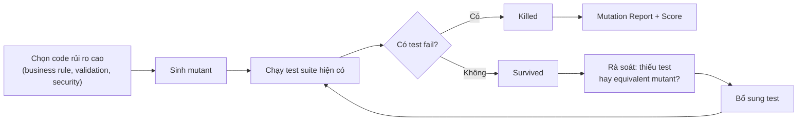

# Báo cáo: Mutation Testing & Test Effectiveness

## Thông tin nhóm

| MSSV     | Họ và tên         | Đóng góp (%) |
| -------- | ----------------- | ------------ |
| 23127539 | Nguyễn Thanh Tiến |              |
| 23127296 | Nguyễn Thành Luân |              |
| 23127404 | Lê Tuấn Lộc       |              |
| 23127061 | Trương Lý Khải    |              |
| 23127330 | Ngô An Bình       |              |

**GitHub Repository**: [mutation-testing & test effectiveness](https://github.com/NguyenThanhTien539/mutation-testing)

## Đặt vấn đề

Code Coverage là một chỉ số phổ biến để đánh giá mức độ bao phủ của bộ kiểm thử, tuy nhiên nó chỉ cho biết mã nguồn đã được thực thi hay chưa mà không phản ánh liệu kết quả có được kiểm chứng đầy đủ hay không. Một test suite có thể đạt Code Coverage rất cao, thậm chí 100%, nhưng vẫn không phát hiện được lỗi logic nếu thiếu các assertion hoặc các trường hợp kiểm thử phù hợp. Để giải quyết hạn chế này, Mutation Testing được đề xuất như một phương pháp đánh giá hiệu quả của bộ kiểm thử bằng cách cố ý tạo ra các thay đổi nhỏ trong mã nguồn và kiểm tra xem test hiện tại có phát hiện được các thay đổi đó hay không.

## 1. Mutation Testing là gì

Mutation Testing tạo ra các phiên bản code bị thay đổi nhỏ, có chủ đích, gọi là **mutant** (ví dụ đổi `>=` thành `>`), rồi chạy lại test suite hiện có trên từng mutant:

- Nếu có test **fail** → mutant bị **killed** (test tốt).
- Nếu toàn bộ test **pass** → mutant **survived** (test suite có lỗ hổng: thiếu assertion, thiếu boundary/negative case).

Mục đích chính không phải tìm bug trong production code, mà là **đo độ mạnh của chính bộ test** ("test the tests").

## 2. Quy trình



1. Chọn source code quan trọng (business rule, validation, security).
2. Sinh mutant bằng các mutation operators.
3. Chạy test suite hiện có trên từng mutant.
4. Phân loại: killed / survived / no coverage / timeout.
5. Rà soát mutant survived → xác định là thiếu test hay là equivalent mutant.
6. Bổ sung test, chạy lại, tính mutation score.

## 3. Các Toán tử Đột biến (Mutation Operators)

Các **toán tử đột biến (Mutation Operators)** là các quy tắc được công cụ Mutation Testing sử dụng để tạo ra những phiên bản mã nguồn đã được sửa đổi có chủ đích, gọi là **mutants**. Mỗi toán tử mô phỏng một loại lỗi lập trình phổ biến nhằm đánh giá khả năng của bộ kiểm thử trong việc phát hiện các lỗi này.

Bảng dưới đây trình bày các nhóm toán tử đột biến phổ biến cùng với những loại lỗ hổng kiểm thử mà chúng thường giúp phát hiện.

| **Nhóm Toán tử**                   | **Ví dụ Đột biến**                                             | **Lỗ hổng Kiểm thử Thường Phát hiện**                                                                                                        |
| ---------------------------------- | -------------------------------------------------------------- | -------------------------------------------------------------------------------------------------------------------------------------------- |
| **Số học**                         | `+` → `-`<br>`>=` → `>`<br>`==` → `!=`                         | Thiếu kiểm thử giá trị biên (_boundary testing_) hoặc thiếu assertion kiểm tra chính xác giá trị đầu ra.                                     |
| **Luận lý**                        | `&&` → `\|\|`<br>`\|\|` → `&&`                                 | Thiếu các trường hợp kiểm thử kết hợp điều kiện (_combination testing_) hoặc chưa bao phủ đầy đủ các nhánh quyết định (_decision branches_). |
| **Giá trị trả về / Boolean**       | `true` → `false`<br>`return x` → `return null` hoặc `return 0` | Assertion chưa đủ mạnh để xác minh giá trị trả về hoặc chưa kiểm thử các trường hợp ngoại lệ và giá trị mặc định.                            |
| **Loại bỏ câu lệnh / Lời gọi hàm** | Xóa `sendEmail()`<br>Xóa khối `else`                           | Thiếu kiểm tra các **side effects** (ví dụ: gửi email, ghi log, cập nhật cơ sở dữ liệu) hoặc chưa xác minh đầy đủ hành vi của hệ thống.      |
| **Hằng số / Tập hợp / Chuỗi**      | `0.2` → `0.05`<br>`[1,2]` → `[]`<br>`"admin"` → `""`           | Chưa kiểm tra các hằng số nghiệp vụ quan trọng, chưa xử lý trường hợp tập hợp rỗng hoặc chưa xác minh tính đúng đắn của dữ liệu chuỗi.       |
| **Biểu thức chính quy**            | Thay đổi hoặc nới lỏng biểu thức Regex                         | Thiếu các trường hợp _negative testing_ để kiểm tra dữ liệu đầu vào không hợp lệ hoặc sai định dạng.                                         |

> **Nhận xét:** Mỗi nhóm toán tử đột biến đại diện cho một nhóm lỗi lập trình phổ biến. Nếu một mutant vẫn survive, điều đó cho thấy bộ kiểm thử còn thiếu trường hợp kiểm thử hoặc assertion phù hợp. Vì vậy, Mutation Testing giúp xác định điểm yếu của bộ kiểm thử, trong khi Code Coverage chỉ phản ánh mức độ thực thi mã nguồn.

## 4. Điểm số Đột biến (Mutation Score)

Điểm số đột biến (Mutation Score) là một số đo định lượng phản ánh hiệu quả thực sự của bộ kiểm thử (test suite) trong việc phát hiện lỗi logic, có giá trị và độ tin cậy cao hơn so với tỷ lệ bao phủ mã (code coverage) thông thường.

Mutation Score được tính theo công thức:

$$ \text{Mutation Score} = \frac{\text{Killed} + \text{Timeout}}{\text{Total Mutants}} \times 100\% $$

### 4.1. Phân loại trạng thái của Đột biến (Mutants)

| Thuật ngữ       | Ý nghĩa và Đánh giá                                                                                                                                                                                      |
| :-------------- | :------------------------------------------------------------------------------------------------------------------------------------------------------------------------------------------------------- |
| **Killed**      | Ít nhất một test case thất bại (fail) khi chạy trên mã đột biến. Điều này chứng tỏ test case đã phát hiện thành công sự thay đổi, khẳng định độ chặt chẽ của các câu lệnh kiểm chứng (assertion).        |
| **Survived**    | Toàn bộ test case đều vượt qua (pass) dù mã nguồn đã bị thay đổi logic. Đây là dấu hiệu cảnh báo bộ kiểm thử đang có lỗ hổng (thiếu kịch bản test hoặc assertion quá lỏng lẻo).                          |
| **Timeout**     | Mã đột biến gây ra vòng lặp vô hạn hoặc làm tăng đột biến thời gian thực thi (ví dụ: mất điều kiện dừng của vòng lặp `while`). Các công cụ tự động ngắt và tính trạng thái này tương đương với _Killed_. |
| **No Coverage** | Đột biến sinh ra ở dòng code không có bất kỳ test case nào chạy qua. Trạng thái này mặc định được đánh giá là _Survived_.                                                                                |

### 4.2. Đánh giá chất lượng Test Suite qua Mutation Score

Mutation Score là thước đo sắc bén nhất để đánh giá "sức mạnh" của bộ kiểm thử. Khác với Code Coverage (chỉ cho biết đoạn code nào được chạy qua), Mutation Score chứng minh được test suite có thực sự bắt được lỗi khi logic thay đổi hay không.

#### Mutation Score cao (ví dụ: > 80% - 90%)

- **Ý nghĩa:** Bộ kiểm thử có chất lượng rất tốt. Các kịch bản kiểm thử bao quát được hầu hết các nhánh logic và các câu lệnh `assert` được viết cực kỳ chặt chẽ, chính xác.
- **Tác động:** Mang lại sự tự tin cao độ cho đội ngũ phát triển. Lập trình viên có thể mạnh dạn tái cấu trúc (refactor) mã nguồn, thêm tính năng mới hoặc nâng cấp thư viện mà không sợ gây ra lỗi hồi quy (regression bugs). Bất kỳ thay đổi sai lệch nào cũng sẽ bị test suite phát hiện và báo đỏ ngay lập tức.

#### Mutation Score thấp

- **Ý nghĩa:** Bộ kiểm thử đang yếu và tồn tại nhiều "điểm mù". Dù Code Coverage có thể rất cao (thậm chí 100%), nhưng các test cases chỉ đơn thuần là thực thi hàm (execute) chứ không kiểm chứng kỹ lưỡng kết quả trả về hay trạng thái hệ thống (thiếu/yếu assertions).
- **Tác động:** Tạo ra cảm giác an toàn giả tạo (false sense of security). Khi có lỗi logic thực sự xảy ra hoặc có người vô tình sửa sai code, bộ kiểm thử vẫn báo "xanh" (pass), dẫn đến nguy cơ lọt lỗi nghiêm trọng ra môi trường production.
- **Giải pháp:** Cần rà soát lại các mutants đang ở trạng thái _Survived_, từ đó bổ sung thêm test cases cho các trường hợp biên (edge cases) hoặc viết lại các assertions sao cho cụ thể và khắt khe hơn.

## 5. Test Effectiveness & Assertion Testing

- **Nguyên lý nền tảng:** Kiểm thử phần mềm chỉ có thể chứng minh sự hiện diện của lỗi (presence of defects), hoàn toàn không thể chứng minh sự vắng mặt tuyệt đối của chúng (absence of defects). Do đó, chất lượng của bộ kiểm thử phụ thuộc trực tiếp vào tính khắt khe của các chiến lược kiểm chứng.
- **Vai trò cốt lõi của Assertion (Câu lệnh kiểm chứng):** Assertion đóng vai trò là các trạm kiểm soát (checkpoints) mang tính quyết định để xác nhận tính đúng đắn của hành vi hệ thống. Việc thiếu vắng assertion hoặc sử dụng assertion quá lỏng lẻo (weak assertions) là nguyên nhân phổ biến nhất khiến các mã đột biến (mutants) rơi vào trạng thái _Survived_, ngay cả khi tỷ lệ bao phủ mã (Code Coverage) đạt mức rất cao.

- **Tiêu chuẩn về Test Effectiveness:** Một bộ kiểm thử chất lượng không được phép chỉ tập trung vào các luồng xử lý lý tưởng (Happy Path). Để đạt hiệu quả cao, nó bắt buộc phải bao phủ:
  - **Trường hợp biên (Boundary conditions):** Ranh giới của các giá trị hợp lệ và không hợp lệ.
  - **Kiểm thử tiêu cực (Negative cases):** Khả năng chịu lỗi và xử lý các ngoại lệ khi nhận dữ liệu sai lệch.
  - **Tác động phụ (Side-effects):** Các thay đổi về trạng thái hệ thống bên ngoài giá trị trả về trực tiếp (ví dụ: sự thay đổi trong Database, log files, hoặc các lời gọi API bên ngoài).

## 6. Code Coverage vs Mutation Testing

Mặc dù cả hai đều là những công cụ quan trọng trong việc đánh giá chất lượng bộ kiểm thử, Code Coverage và Mutation Testing tiếp cận vấn đề từ hai góc độ hoàn toàn khác nhau. Chúng không thay thế mà mang tính bổ trợ cho nhau.

Bảng dưới đây phân tích sự khác biệt cốt lõi giữa hai phương pháp này:

| Tiêu chí Đánh giá (Criteria)         | Code Coverage                                                                                                                                              | Mutation Testing                                                                                                                                               |
| :----------------------------------- | :--------------------------------------------------------------------------------------------------------------------------------------------------------- | :------------------------------------------------------------------------------------------------------------------------------------------------------------- |
| **Bản chất Đo lường**                | **Định lượng :** Chỉ xác nhận việc một dòng lệnh, nhánh (branch) hoặc hàm có được thực thi hay không khi chạy test suite.                                  | **Định tính :** Xác nhận khả năng phát hiện lỗi thực sự (fault-revealing capability) của bộ kiểm thử khi logic bị thay đổi.                                    |
| **Vai trò trong Đảm bảo Chất lượng** | **Ngưỡng tối thiểu (Lower Bound):** Là "điều kiện cần". Chỉ ra những vùng mã nguồn _chưa_ được kiểm thử.                                                   | **Ngưỡng tối đa (Upper Bound):** Là "điều kiện đủ". Đóng vai trò là thước đo độ tin cậy và tính chặt chẽ thực sự của test suite.                               |
| **Chi phí Thực thi**                 | **Thấp & Nhanh chóng:** Ít tiêu tốn tài nguyên, tích hợp dễ dàng vào các quá trình CI/CD với thời gian phản hồi gần như tức thì.                           | **Cao & Tốn kém:** Yêu cầu sức mạnh tính toán lớn do phải sinh ra $N$ mutants và biên dịch/chạy lại $M$ test cases tương ứng.                                  |
| **Hạn chế Cốt lõi**                  | **Dễ tạo cảm giác an toàn giả tạo:** Bộ kiểm thử có thể đạt Coverage 100% nhưng hoàn toàn vô dụng nếu thiếu các câu lệnh kiểm chứng (assertions) khắt khe. | **Vấn đề "Đột biến tương đương":** Có thể sinh ra các equivalent mutants không làm thay đổi hành vi chương trình, gây nhiễu điểm số và cần phân tích thủ công. |

## 7. Equivalent Mutants và Các Hạn chế

Dù là phương pháp đánh giá mạnh mẽ nhất, Kiểm thử Đột biến (Mutation Testing) vẫn vấp phải những rào cản lớn trong quá trình áp dụng thực tế, đặc biệt là vấn đề về đột biến tương đương và chi phí tài nguyên.

### 7.1. Equivalent Mutants

- **Định nghĩa:** Là những đột biến làm thay đổi cú pháp mã nguồn nhưng hoàn toàn **không làm thay đổi ngữ nghĩa hoặc hành vi** của chương trình. (Ví dụ: Đảo vị trí phép toán `a + b` thành `b + a` đối với số nguyên, hoặc thay đổi điều kiện lặp nhưng không ảnh hưởng đến số lần lặp thực tế).
- **Hệ quả:** Vì hành vi không đổi, không có bất kỳ kịch bản kiểm thử nào (dù hoàn hảo đến đâu) có thể làm fail đoạn code này. Đột biến sẽ luôn ở trạng thái _Survived_. Đây **không phải là lỗi của test suite**, mà là một "nhiễu loạn" tự nhiên làm giảm tính chính xác của Mutation Score.

### 7.2. Các Hạn chế Kỹ thuật Khác

- **Bùng nổ tổ hợp (Combinatorial Explosion):** Đối với các dự án quy mô vừa và lớn (Enterprise-level), công cụ có thể dễ dàng sinh ra hàng trăm nghìn đột biến từ mã nguồn, tạo ra một khối lượng công việc khổng lồ.
- **Chi phí thực thi đắt đỏ (High Execution Cost):** Với $N$ đột biến được sinh ra, hệ thống phải biên dịch lại mã nguồn và chạy toàn bộ $M$ kịch bản kiểm thử (hoặc một tập hợp con liên quan). Tài nguyên tính toán và thời gian tiêu tốn là rất lớn so với kiểm thử thông thường.
- **Sự phụ thuộc vào Công cụ (Tooling Dependency):** Các công cụ Mutation Testing đòi hỏi sự can thiệp sâu vào bytecode/AST (Abstract Syntax Tree) nên phụ thuộc rất chặt chẽ vào ngôn ngữ và phiên bản trình biên dịch (VD: PIT cho Java, Stryker cho JavaScript/C#). Hệ sinh thái công cụ chưa thực sự phong phú và ổn định ở mọi ngôn ngữ như các công cụ đo Code Coverage.

## 8. Khảo sát công cụ (11 công cụ)

| Công cụ       | Ngôn ngữ | Loại     | Giá                                  | Điểm mạnh                                     | Điểm yếu                                       |
| ------------- | -------- | -------- | ------------------------------------ | --------------------------------------------- | ---------------------------------------------- |
| StrykerJS     | JS/TS    | Mutation | Miễn phí (Apache 2.0)                | Report HTML trực quan, nhiều test runner      | Chạy chậm trên project lớn                     |
| Stryker.NET   | C#/.NET  | Mutation | Miễn phí                             | `since`/baseline giảm thời gian chạy          | Cấu hình nhiều test project phức tạp           |
| PIT (Pitest)  | Java     | Mutation | Miễn phí (core)                      | Bytecode mutation nhanh, coverage-guided      | JUnit 5 cần plugin riêng                       |
| Mutmut        | Python   | Mutation | Miễn phí (BSD-3)                     | Cực dễ dùng, cache SQLite, coverage-guided    | Đơn tiến trình mặc định, chậm trên project lớn |
| Cosmic Ray    | Python   | Mutation | Miễn phí (BSD-2)                     | Kiến trúc phân tán (Celery), pause/resume     | Cấu hình phức tạp, rào cản người mới           |
| Infection     | PHP      | Mutation | Miễn phí (BSD-3)                     | Đột biến AST, dễ viết mutator mới             | Cần PHP 8.3+, Xdebug/pcov                      |
| Major         | Java     | Mutation | Không xác nhận được giấy phép cụ thể | MML cấu hình chi tiết, mutant-test matrix     | Thiếu tài liệu, cộng đồng nhỏ                  |
| Istanbul/nyc  | JS/TS    | Coverage | Miễn phí (ISC)                       | Chuẩn công nghiệp, dễ dùng                    | Chỉ đo coverage, không xác minh assertion      |
| JaCoCo        | Java     | Coverage | Miễn phí (EPL)                       | Nhẹ, tích hợp Maven/Gradle tốt                | "Ảo giác an toàn" nếu chỉ ép % coverage        |
| Jest Coverage | JS/TS    | Coverage | Miễn phí (MIT)                       | Tích hợp sẵn trong Jest, dễ bật               | Chỉ đo coverage, không xác minh assertion      |
| Coverage.py   | Python   | Coverage | Miễn phí (Apache 2.0)                | Chuẩn công nghiệp Python, nền tảng cho Mutmut | Branch coverage không bật mặc định             |

## 9. Phân tích chuyên sâu 4 công cụ được lựa chọn

Trong 11 công cụ khảo sát ở Mục 8, nhóm chọn ra 4 công cụ để phân tích chuyên sâu nguyên lý hoạt động: **StrykerJS** và **Mutmut** (đại diện nhóm Mutation Testing), **Istanbul** và **Coverage.py** (đại diện nhóm đo Test Effectiveness qua Code Coverage). Đây là 2 cặp công cụ cùng vai trò nhưng thuộc 2 hệ sinh thái ngôn ngữ khác nhau (JavaScript/TypeScript và Python), phù hợp để đối chiếu chéo cách mỗi hệ sinh thái giải quyết cùng một bài toán kỹ thuật.

### 9.1. StrykerJS và Kỹ thuật Mutant Schemata (Mutation Switching)

Thay vì áp dụng mô hình "cổ điển" (tạo ra một bản sao mã nguồn hoặc tệp tin vật lý riêng biệt cho mỗi đột biến), StrykerJS sử dụng kỹ thuật **Mutant Schemata** (hay còn gọi là _Mutation Switching_). Kỹ thuật này **nhúng toàn bộ các đột biến (mutants) vào cùng một tệp mã nguồn duy nhất**. Mỗi đột biến sẽ được cô lập và điều khiển bởi một điều kiện kiểm tra thông qua biến toàn cục (ví dụ: `global.__stryker__.activeMutant`).

**Minh họa cơ chế nội sinh (Instrumentation):**

```javascript
// Mã nguồn gốc
function add(a, b) {
  return a + b;
}

// Mã nguồn sau khi được Stryker cấy ghép (instrumentation - bản rút gọn)
function add(a, b) {
  return global.__stryker__.activeMutant === 1
    ? a - b // Mutant #1: Thay đổi phép toán + thành -
    : a + b; // Mã nguồn gốc: Thực thi khi không có mutant nào được kích hoạt
}
```

Nhờ kiến trúc **Mutant Schemata**, StrykerJS giải quyết triệt để bài toán về hiệu năng và mang lại những tối ưu hóa vượt trội:

- **Tối ưu hóa quá trình Biên dịch (Build/Transpile):** Các công đoạn nặng nề và tốn kém tài nguyên như build, bundle hay transpile (thông qua Webpack, `tsc`...) chỉ cần thực hiện **một lần duy nhất** cho toàn bộ quá trình kiểm thử, thay vì phải lặp lại cho từng mutant.
- **Chiến lược Chạy thử (Dry Run) & Theo dõi Bao phủ (Per-test Mutant Coverage):** Trước khi tiến hành kiểm thử đột biến thực sự, Stryker thực hiện một pha chạy thử (_dry run_) để lập bản đồ (mapping) xác định chính xác test case nào đi qua dòng code nào.
- **Kiểm thử Có mục tiêu (Targeted Testing):** Dựa vào tập dữ liệu từ bước _dry run_, khi tới lượt kích hoạt một mutant cụ thể, Stryker chỉ thực thi các test cases có liên quan trực tiếp thay vì phải chạy toàn bộ test suite. Các mutants nằm ở những dòng code không có test nào chạm tới sẽ tự động bị đánh dấu **No Coverage** ngay lập tức để tiết kiệm thời gian.
- **Thực thi Song song & Tăng dần (Parallel & Incremental Execution):** StrykerJS hỗ trợ xử lý đa tiến trình (parallel test runners) và chế độ kiểm thử tăng dần (thông qua cờ `--incremental`, `--since`). Cơ chế này cho phép hệ thống chỉ chạy lại các mutant trên phần mã nguồn vừa bị thay đổi — đây chính là chiến lược tối ưu hóa mà nhóm đã áp dụng thực tế khi giới hạn phạm vi `mutate` trong phần demo (tham khảo Mục 10).

### 9.2. Mutmut và cơ chế Exit Code-based

Trái ngược với cách tiếp cận phức tạp của StrykerJS, **Mutmut** (công cụ phổ biến trong hệ sinh thái Python) theo đuổi triết lý thiết kế tinh gọn và trực diện:

- **Cơ chế Thực thi:** Với mỗi đột biến, Mutmut sẽ can thiệp và sửa đổi trực tiếp tệp mã nguồn thực tế (có cơ chế sao lưu tự động - backup). Sau đó, nó kích hoạt trình chạy kiểm thử (test runner - mặc định là `pytest`, nhưng có thể là bất kỳ lệnh nào) và đánh giá trạng thái đột biến (Killed hoặc Survived) hoàn toàn dựa vào mã lỗi trả về (Exit Code).
- **Ưu điểm (Tính phổ quát):** Việc chỉ phụ thuộc vào Exit Code giúp Mutmut **tương thích với mọi trình chạy kiểm thử** mà không cần phải phát triển các plugin tích hợp riêng lẻ.
- **Nhược điểm (Hiệu năng):** Đổi lấy sự đơn giản, Mutmut thiếu cơ chế chọn lọc kịch bản kiểm thử tinh vi (per-test mutant coverage) như StrykerJS. Do phải khởi động lại tiến trình Python cho từng đột biến, công cụ này thường hoạt động chậm hơn trên các dự án quy mô lớn.

Để bù đắp hạn chế về tốc độ, Mutmut tích hợp hai cơ chế tối ưu hóa quan trọng:

- **Tối ưu hóa dựa trên Bao phủ mã (Coverage-guided mutation):** Mutmut có khả năng tích hợp và đọc dữ liệu đã thu thập từ công cụ `Coverage.py`. Nó sẽ chủ động loại bỏ việc sinh đột biến ở những dòng mã chưa được kịch bản kiểm thử nào bao phủ. Đây là minh chứng điển hình cho sự cộng sinh giữa công cụ đo lường Coverage truyền thống và Mutation Testing, giúp ngăn chặn việc sinh ra các mutants "chắc chắn Survived" làm lãng phí tài nguyên.
- **Cơ chế Lưu trữ Bộ đệm (Caching - `.mutmut-cache`):** Mutmut ghi nhớ trạng thái và kết quả của các đột biến đã kiểm tra. Nếu mã nguồn liên quan không thay đổi, lần chạy tiếp theo sẽ tự động bỏ qua. Nhờ vậy, người dùng có thể chủ động dừng tiến trình `mutmut run` và tiếp tục lại bất kỳ lúc nào mà không mất dữ liệu. Tính năng này đặc biệt phù hợp để tích hợp kiểm thử đột biến vào thói quen lập trình hàng ngày (daily routines) thay vì phải chờ đợi một lần chạy nguyên khối tốn kém.

> **Lưu ý về Môi trường Triển khai:** Về mặt kiến trúc hệ điều hành, Mutmut yêu cầu cơ chế tạo tiến trình `fork` (đặc trưng của hệ thống Unix). Do đó, trên môi trường Windows, công cụ này bắt buộc phải được vận hành thông qua Hệ thống con Windows dành cho Linux (WSL).

### 9.3. Istanbul/nyc — Kỹ thuật Source-level Instrumentation

Istanbul đo lường Code Coverage bằng cách **chèn trực tiếp các bộ đếm vào mã nguồn**. Công cụ này phân tích mã thông qua AST bằng `istanbul-lib-instrument` hoặc `babel-plugin-istanbul`, sau đó thêm các counter như `cov.s[N]++` (statement), `cov.f[N]++` (function) và `cov.b[N][0/1]++` (branch). Khi test được thực thi, các bộ đếm sẽ cập nhật dữ liệu vào đối tượng coverage (`global.__coverage__` trên Node.js hoặc `window.__coverage__` trên trình duyệt). Công cụ `nyc` chịu trách nhiệm điều phối quá trình instrument, thu thập dữ liệu và xuất báo cáo (text, HTML, LCOV, JSON).

Do can thiệp trực tiếp vào AST trước khi mã được transform, Istanbul có độ chính xác cao, đặc biệt với branch coverage trong các cấu trúc logic phức tạp. Tuy nhiên, phương pháp này có thể chậm hơn so với các công cụ dựa trên coverage tích hợp của V8 như `c8`, vốn có nguy cơ sai lệch khi phải ánh xạ lại bằng source map sau quá trình bundle hoặc transpile.

### 9.4. Coverage.py — Kỹ thuật Engine-native Instrumentation

Trái ngược hoàn toàn với phương pháp của Istanbul, Coverage.py **không chèn bất kỳ câu lệnh hay bộ đếm nào vào mã nguồn**. Thay vào đó, công cụ này trực tiếp khai thác cơ chế theo dõi luồng thực thi (execution tracking) được tích hợp sẵn bên trong trình thông dịch (interpreter) của Python. Đây chính là nguyên lý _Engine-native instrumentation_, tương tự như cách V8 coverage hoạt động nhưng được thiết kế chuyên biệt cho hệ sinh thái Python. Coverage.py vận hành dựa trên 3 lõi (cores) theo dõi khác nhau:

- **`ctrace` (Mặc định):** Sử dụng API `sys.settrace()` kết hợp với các hàm theo dõi (trace functions) được viết bằng C extension. Phương pháp này giúp giảm thiểu đáng kể chi phí hiệu năng (overhead) so với việc gọi các hàm callback thuần Python trên từng dòng lệnh.
- **`pytrace`:** Áp dụng cùng cơ chế `sys.settrace()` nhưng được triển khai hoàn toàn bằng Python thuần. Lõi này thường hoạt động như một phương án dự phòng (fallback) khi hệ thống không hỗ trợ C extension tương ứng, đi kèm với tốc độ thực thi chậm hơn đáng kể.
- **`sysmon` (Từ Python 3.12+):** Tận dụng tối đa API `sys.monitoring` thế hệ mới. Lõi này mang lại hiệu suất vượt trội so với cơ chế `sys.settrace()` truyền thống (vốn ban đầu được thiết kế chủ yếu cho mục đích gỡ lỗi - debugging).

Toàn bộ dữ liệu thu thập sẽ được lưu trữ vào tệp `.coverage`. Về bản chất, đây là một cơ sở dữ liệu SQLite, thiết kế này cho phép hệ thống dễ dàng tổng hợp (`coverage combine`) kết quả kiểm thử từ nhiều tiến trình chạy song song (ví dụ: qua `pytest-xdist`) hoặc từ nhiều môi trường ảo khác nhau (như `tox`). Hơn nữa, Coverage.py còn cung cấp tính năng Dynamic Context, tự động gắn nhãn dữ liệu theo tên của từng kịch bản kiểm thử (test case) đang chạy. Nhờ đó, nó không chỉ trả lời được câu hỏi định lượng _"Dòng code này có được thực thi hay không?"_, mà còn giải quyết được bài toán truy vết: _"Dòng code này đã được kích hoạt bởi test case cụ thể nào?"_.

### 9.5. Đối chiếu chéo

| Khía cạnh      | StrykerJS ↔ Mutmut                                                                                                                             | Istanbul ↔ Coverage.py                                                                                                                                   |
| -------------- | ---------------------------------------------------------------------------------------------------------------------------------------------- | -------------------------------------------------------------------------------------------------------------------------------------------------------- |
| Cùng vai trò   | Mutation testing                                                                                                                               | Đo code coverage                                                                                                                                         |
| Cách can thiệp | Stryker: nhúng tất cả mutant vào 1 file, switch bằng biến toàn cục. Mutmut: sửa trực tiếp file, chạy tuần tự từng mutant                       | Istanbul: chèn counter vào AST (source-level). Coverage.py: hook vào interpreter qua `sys.settrace`/`sys.monitoring` (engine-native), không sửa mã nguồn |
| Đánh đổi       | Stryker nhanh hơn nhờ build 1 lần nhưng phức tạp hơn để cài đặt; Mutmut đơn giản, phổ quát (chỉ cần exit code) nhưng chậm hơn trên project lớn | Istanbul chính xác cao nhưng có overhead runtime; Coverage.py "trong suốt" với mã nguồn, overhead phụ thuộc core được chọn                               |

## 10. Kết quả demo

Nhóm thực hiện demo tương quan giữa Code Coverage và Mutation Score trên 2 cặp công cụ đã chọn ở Mục 9. Mỗi cặp công cụ có một repository demo riêng, phần dưới đây tổng hợp lại kết quả.

### 10.1. StrykerJS + Istanbul

- **Repository**: [eshop](https://github.com/NgThanhLuanK23HCMUS/eshop-clone)

- **Phạm vi**: `src/context/AuthContext.jsx` + `src/pages/Checkout.jsx` (luồng Login → Checkout)
- **Công cụ**: coverage đo bằng `@vitest/coverage-istanbul` (`vitest run --coverage`, provider `istanbul` — cùng nền tảng Istanbul/nyc mà `jest --coverage` sử dụng); mutation testing bằng StrykerJS 9.6 (`vitest` test runner, `coverageAnalysis: perTest`).
- **Link demo video**: [video demo](https://youtu.be/K_FPvT8-3xc)

#### Kịch bản test (chuỗi Login → Checkout)

Nhóm chọn một **cặp hàm tuần tự** — hàm B phụ thuộc trực tiếp vào state do hàm A tạo ra — để mô phỏng đúng một luồng nghiệp vụ thật thay vì test hàm đơn lẻ:

| | Hàm | File | Vai trò |
| --- | --- | --- | --- |
| A | `login(email, password)` | `src/context/AuthContext.jsx:26-35` | Gọi `POST /api/login`, lưu `token`/`user` vào state + `localStorage`, gắn header `Authorization` mặc định cho axios |
| B | `handleCheckout()` | `src/pages/Checkout.jsx:40-66` | Đọc `token`/`user` từ `useAuth()` (state do A tạo) để gắn `Authorization: Bearer <token>` khi gọi `POST /api/checkout` |

B không thể được kiểm thử đúng đắn nếu không có A chạy trước: nếu test chỉ gọi B một mình (không login), `token` luôn `null` và nhánh `headers: token ? {...} : {}` chỉ bao giờ chạm nhánh `else`.

**Bước 1 — Test baseline (yếu):** trước khi có test chained, nhóm viết một test yếu để mô phỏng đúng thực trạng "coverage tồn tại nhưng không kiểm chứng gì" — chỉ `render()` rồi kiểm tra 2 đoạn text tĩnh, không gọi `login()`, không submit checkout, không thao tác coupon. Kết quả: 109 mutant sinh ra trên 2 file, chỉ 4 mutant Killed, 77 mutant hoàn toàn No Coverage (71%).

**Bước 2 — Mutant sống sót ở baseline:** trong số mutant có coverage nhưng vẫn Survived đều có trường hợp một số giá trị của biến sai - chứng minh test "chạy qua" dòng code nhưng không hề đọc hay xác nhận giá trị bên trong.

**Bước 3 — Test tích hợp:** nhóm viết lại test cho Checkout với 17 test case, đảm bảo đã integrate với Login.

Các test case còn lại trong bộ bao phủ thêm: checkout không có `Authorization` header khi chưa login; trang "Thanh toán thành công!" hiển thị đúng sau khi checkout OK; `setLoading(false)` chạy lại sau lỗi (nút không kẹt "Đang xử lý..."); phân biệt `&&` thật với `||` giả khi áp coupon lúc chưa login; lỗi mạng không có `response` object rơi về thông báo mặc định; `logout()` xoá header `Authorization` mặc định của axios; session được khôi phục từ `localStorage` lúc mount.

**Bước 4 — Kết quả:** sau khi chạy lại Stryker, toàn bộ 10 mutant Survived ban đầu đều bị diệt; số liệu chi tiết ở bảng dưới. Vòng lặp bổ sung test tiếp tục phát hiện thêm vài mutant Survived mới ở những dòng *lần đầu được coverage* — đúng minh chứng cho hiện tượng coverage illusion.

#### Bảng số liệu

| Chỉ số                                                 | Trước integrate | Sau integrate |      Δ |
| ------------------------------------------------------ | --------------: | ------------: | -----: |
| Statement coverage                                     |          39.39% |        90.90% | +51.51 |
| Line coverage                                          |          40.32% |        91.93% | +51.61 |
| Branch coverage                                        |          26.47% |        97.05% | +70.58 |
| Function coverage                                      |          28.57% |        78.57% | +50.00 |
| Mutation score (killed + timeout / total)              |          20.18% |        90.83% | +70.65 |
| Mutation score (chỉ tính killed / total, khắt khe hơn) |           3.67% |        55.96% | +52.29 |
| Mutant Survived                                        |              10 |             6 |     −4 |
| Mutant No Coverage                                     |              77 |             4 |    −73 |

#### Trước integrate: minh chứng "coverage illusion"

Bộ test baseline ban đầu chỉ có 2 test case, cả hai chỉ gọi `render()` rồi kiểm tra một dòng chữ tĩnh xuất hiện trên màn hình, không có assertion nào kiểm tra logic. Vì `render()` vẫn chạy toàn bộ thân component (khởi tạo state, tính `cartTotal`, dựng JSX cho các nhánh mặc định), statement coverage đã lên tới ~38-40% dù chưa kiểm chứng bất kỳ hành vi nào. Một số ví dụ cụ thể được ghi nhận:

| Vị trí                                                       | Trạng thái Coverage                       | Trạng thái Mutation                              | Ý nghĩa                                                                                                                   |
| ------------------------------------------------------------ | ----------------------------------------- | ------------------------------------------------ | ------------------------------------------------------------------------------------------------------------------------- |
| `Checkout.jsx` — `if (success)`                              | Covered (nhánh `false` chạy khi mount)    | **Survived** (mutant `if (false)`)               | Coverage chỉ ghi nhận dòng `if` có chạy qua, không biết nhánh `true` (trang thành công) có từng được kiểm chứng hay không |
| `Checkout.jsx` — `{couponError && (...)}`                    | Covered                                   | **Survived** (mutant đổi `&&`/giá trị điều kiện) | JSX conditional render "chạy qua" ở mọi lần render dù giá trị điều kiện không đổi                                         |
| `AuthContext.jsx` — `value={{ user, token, login, logout }}` | Covered (object luôn được tạo mỗi render) | **Survived** (mutant `value={{}}`)               | Object literal được tạo ra nhưng không có test nào đọc field bên trong nó → coverage xanh, hành vi sai vẫn lọt qua        |

Khoảng cách giữa coverage (40.32%) và mutation score (20.18%, hoặc chỉ 3.67% nếu tính khắt khe) minh hoạ đúng luận điểm lý thuyết ở Mục 6: coverage đo việc code có được thực thi, còn mutation testing đo việc test có khẳng định đúng hành vi của code đó hay không.

#### Sau integrate: hai chỉ số hội tụ

Sau khi thay bằng bộ test "chained" gồm 17 test case (gọi thật hàm `login()`, dùng `token`/`user` trả về để lái `handleCheckout()` và kiểm tra kết quả thực sự), khoảng cách giữa hai chỉ số thu hẹp từ **20.14 điểm phần trăm** (40.32% coverage − 20.18% mutation score) xuống còn **1.10 điểm phần trăm** (91.93% − 90.83%). Phần chênh lệch nhỏ còn lại đến từ 6 mutant Survived nằm trên các dòng đã covered nhưng biến thể tạo ra hành vi quan sát-tương đương trong đúng kịch bản test hiện có — một minh chứng khác, ở quy mô nhỏ hơn, cho việc coverage cao không đảm bảo triệt tiêu hoàn toàn khoảng trống kiểm thử.

### 10.2. Mutmut + Coverage.py

- **Repository**: _(cần bổ sung)_
- **File kết quả chi tiết**: _(cần bổ sung)_
- **Phạm vi**: _(cần bổ sung — module Python nào được chọn để demo)_
- **Công cụ**: coverage đo bằng Coverage.py (qua `pytest-cov` hoặc `coverage run`); mutation testing bằng Mutmut (coverage-guided, đọc dữ liệu từ `.coverage`)
- **Link demo video**: _(cần bổ sung)_

#### Bảng số liệu

| Chỉ số                                     | Trước integrate |   Sau integrate |               Δ |
| ------------------------------------------ | --------------: | --------------: | --------------: |
| Statement coverage                         | _(cần bổ sung)_ | _(cần bổ sung)_ | _(cần bổ sung)_ |
| Branch coverage                            | _(cần bổ sung)_ | _(cần bổ sung)_ | _(cần bổ sung)_ |
| Mutation score (killed + timeout / total)  | _(cần bổ sung)_ | _(cần bổ sung)_ | _(cần bổ sung)_ |
| Mutant Survived                            | _(cần bổ sung)_ | _(cần bổ sung)_ | _(cần bổ sung)_ |
| Mutant No Coverage (chưa có test chạy qua) | _(cần bổ sung)_ | _(cần bổ sung)_ | _(cần bổ sung)_ |

#### Trước integrate

_(cần bổ sung — ví dụ cụ thể về dòng/nhánh code được coverage ghi nhận là "chạy qua" nhưng mutant tương ứng vẫn Survived)_

#### Sau integrate

_(cần bổ sung — số liệu và nhận xét sau khi bổ sung test, đối chiếu mức hội tụ giữa coverage và mutation score)_

## 14. Bảng thuật ngữ

| Thuật ngữ (EN)                       | Tiếng Việt                                                                                                                     |
| ------------------------------------ | ------------------------------------------------------------------------------------------------------------------------------ |
| Mutant                               | Phiên bản code đã bị chèn lỗi nhỏ có chủ đích                                                                                  |
| Killed                               | Mutant bị test phát hiện (test fail)                                                                                           |
| Survived                             | Mutant không bị test nào phát hiện (test vẫn pass)                                                                             |
| No Coverage                          | Mutant nằm ở vùng code không test nào chạy qua                                                                                 |
| Timeout                              | Mutant khiến chương trình chạy quá lâu/vô hạn                                                                                  |
| Equivalent Mutant                    | Mutant có hành vi giống hệt code gốc, không thể bị killed                                                                      |
| Mutation Score                       | Chỉ số % đo hiệu quả test suite qua tỉ lệ mutant bị killed                                                                     |
| Mutation Operator                    | Quy tắc tạo ra một loại thay đổi mutant cụ thể                                                                                 |
| Coverage-guided Mutation             | Chỉ sinh mutant ở vùng code đã có test coverage                                                                                |
| Incremental Mutation Testing         | Chỉ chạy mutation testing trên phần code thay đổi                                                                              |
| Assertion                            | Câu lệnh xác nhận kết quả thực tế khớp kỳ vọng                                                                                 |
| Boundary Value                       | Giá trị nằm ngay tại ranh giới điều kiện (ví dụ `age = 18`)                                                                    |
| Test Effectiveness                   | Mức độ hiệu quả của test suite trong việc phát hiện lỗi                                                                        |
| Quality Gate                         | Ngưỡng chất lượng dùng để chặn/cảnh báo trong CI/CD                                                                            |
| Mutant Schemata (Mutation Switching) | Kỹ thuật nhúng toàn bộ mutant vào cùng một file, kích hoạt từng mutant qua biến toàn cục thay vì tạo file riêng cho mỗi mutant |
| Dry Run                              | Lượt chạy thử test suite trước khi mutation testing thật, dùng để ghi nhận test nào chạm tới dòng code nào                     |
| Exit Code-based Testing              | Cách đánh giá Killed/Survived chỉ dựa vào mã thoát của lệnh test, không cần plugin riêng cho từng test runner                  |
| Source-level Instrumentation         | Kỹ thuật đo coverage bằng cách chèn trực tiếp bộ đếm vào mã nguồn (qua AST)                                                    |
| Engine-native Instrumentation        | Kỹ thuật đo coverage bằng cách khai thác cơ chế theo dõi thực thi có sẵn của runtime/interpreter, không chèn thêm mã nguồn     |
| Dynamic Context                      | Tính năng gắn nhãn dữ liệu coverage theo tên test case đang chạy, cho biết dòng code được test nào chạy qua                    |
| Coverage Illusion                    | Hiện tượng coverage đo được cao nhưng test suite không thực sự kiểm chứng hành vi, do thiếu hoặc yếu assertion                 |
| Combinatorial Explosion              | Sự bùng nổ số lượng mutant khi mutate trên dự án lớn, gây tốn tài nguyên và thời gian thực thi                                 |

## 15. Tài liệu tham khảo

**Sách và bài báo khoa học:**

- Ammann, P., & Offutt, J. (2016). _Introduction to Software Testing_. Cambridge University Press.
- Jia, Y., & Harman, M. (2011). An analysis and survey of mutation testing. _IEEE Transactions on Software Engineering_, 37(5), 649-678. https://doi.org/10.1109/TSE.2010.62
- Offutt, A. J., & Pan, J. (1997). Automatically detecting equivalent mutants. _Software Testing, Verification and Reliability_, 7(3), 165-192.
- Petrovic, G., & Ivankovic, M. (2018). State of Mutation Testing at Google. In _Proceedings of the 40th International Conference on Software Engineering: Software Engineering in Practice_ (ICSE-SEIP '18), 163-171.
- ISTQB. (2024). _Certified Tester — Foundation Level Syllabus v4.0_. https://istqb.org/wp-content/uploads/2024/11/ISTQB_CTFL_Syllabus_v4.0.1.pdf

**Tài liệu chính thức của các công cụ đã khảo sát:**

- StrykerJS / Stryker.NET: https://stryker-mutator.io/docs/
- Stryker — Mutant states and metrics: https://stryker-mutator.io/docs/mutation-testing-elements/mutant-states-and-metrics/
- PIT (Pitest): https://pitest.org/ · Mutation operators: https://pitest.org/quickstart/mutators/
- Mutmut: https://mutmut.readthedocs.io/
- Cosmic Ray: https://cosmic-ray.readthedocs.io/
- Infection PHP: https://infection.github.io/
- Istanbul/nyc: https://istanbul.js.org/
- JaCoCo: https://www.jacoco.org/jacoco/
- Coverage.py: https://coverage.readthedocs.io/ · pytest-cov: https://pytest-cov.readthedocs.io/
- StrykerJS — Mutation Switching: https://stryker-mutator.io/blog/announcing-stryker-4-mutation-switching/
- Stryker — Static mutants (trường hợp không áp dụng được mutation switching): https://stryker-mutator.io/docs/mutation-testing-elements/static-mutants/
- Mutmut — tài liệu chính thức: https://mutmut.readthedocs.io/
- Istanbul/nyc — hướng dẫn cơ chế instrumentation: https://github.com/istanbuljs/nyc/blob/main/docs/instrument.md
- Coverage.py — How coverage.py works (ctrace/pytrace/sysmon): https://coverage.readthedocs.io/en/latest/howitworks.html

**Nguồn khác:**

- Martin Fowler — Mutation Testing: https://martinfowler.com/bliki/MutationTesting.html
- Google Testing Blog — Code Coverage Best Practices: https://testing.googleblog.com/2020/08/code-coverage-best-practices.html
- Tricentis — What is Assertion Testing: https://www.tricentis.com/learn/assertion-testing
- testRigor — Understanding Mutation Testing: A Comprehensive Guide: https://testrigor.com/blog/understanding-mutation-testing-a-comprehensive-guide/
