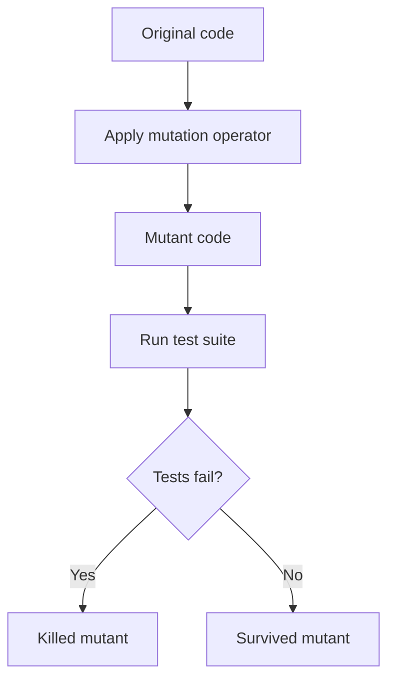

# Mutation Operators

## 1. Mục tiêu

Nghiên cứu các `Mutation Operators` phổ biến được dùng bởi các công cụ `Mutation Testing`, đặc biệt dựa trên các tài liệu đã tham khảo từ testRigor, Stryker Mutator và PIT/Pitest.

Mục tiêu của phần này là làm rõ:

- Mutation tools tạo ra những thay đổi code nào từ `original code`.
- Mỗi loại `mutation operator` mô phỏng dạng lỗi lập trình nào.
- Khi một mutant `survived`, ta có thể suy ra test suite đang yếu ở đâu.
- Cách dùng mutation report để viết thêm test case tốt hơn, thay vì chỉ nhìn vào code coverage.

Trong `mutation testing`, tool không tạo ra lỗi lớn hoặc rewrite toàn bộ chương trình. Tool tạo ra các thay đổi nhỏ, có kiểm soát, gọi là `mutation operators`. Mỗi thay đổi tạo ra một phiên bản code lỗi nhỏ gọi là `mutant`. Sau đó test suite được chạy trên mutant để xem test có phát hiện được lỗi hay không.

## 2. Câu hỏi chính

- Các công cụ Mutation Testing tạo ra những thay đổi code nào?
- Các Mutation Operators phổ biến là gì?
- Mutation Operators giúp phát hiện test case yếu như thế nào?

Trả lời ngắn gọn:

Mutation tools thường tạo các thay đổi như đổi toán tử số học, đổi toán tử so sánh, đổi toán tử logic, thay đổi boolean, thay đổi return value, xóa statement, xóa method call, thay đổi constant/value, thay đổi collection, string hoặc regex. Nếu test suite không fail trước các thay đổi này, mutant sẽ `survived`, cho thấy test có thể thiếu assertion, thiếu boundary case, thiếu negative case hoặc chưa kiểm tra đúng side effect.

## 3. Ghi chú chính

### 3.1 Mutation Operator là gì?

`Mutation operator` là quy tắc tạo ra một thay đổi nhỏ trong code. Ví dụ:

```javascript
// Original code
return age >= 18;

// Mutant code
return age > 18;
```

Ở đây, mutation operator đã đổi toán tử so sánh từ `>=` thành `>`. Nếu test suite không có case `age = 18`, mutant này có thể `survived`.

### 3.2 Workflow tổng quát



Ý nghĩa:

- Nếu test fail, mutant bị `killed`, nghĩa là test suite phát hiện được lỗi giả lập.
- Nếu test vẫn pass, mutant `survived`, nghĩa là test suite có thể chưa kiểm tra behavior đủ mạnh.

### 3.3 Ba nhóm mutation theo testRigor

Theo testRigor, có thể hiểu mutation testing qua ba nhóm lớn:

| Nhóm mutation | Code change được tạo | Ví dụ | Mục đích kiểm tra |
|---|---|---|---|
| `Statement mutation` | Xóa, duplicate, hoặc thay đổi thứ tự statement. | Remove `else`, remove method call, remove `return`. | Kiểm tra test có phát hiện thiếu hành động hoặc thiếu nhánh xử lý không. |
| `Value mutation` | Thay đổi constant, literal, hoặc parameter value. | `2` thành `10`, `true` thành `false`, `"admin"` thành `""`. | Kiểm tra test có assert đúng giá trị cụ thể không. |
| `Decision mutation` | Thay đổi logical/arithmetic/comparison operators. | `>` thành `>=`, `&&` thành `||`, `+` thành `-`. | Kiểm tra test có bắt lỗi ở decision logic và boundary không. |

### 3.4 Các Mutation Operators phổ biến

| Mutation operator | Code change được tạo | Ví dụ original | Ví dụ mutant | Test cần có |
|---|---|---|---|---|
| Arithmetic | Đổi toán tử số học. | `a + b` | `a - b` | Assert exact calculation. |
| Relational boundary | Đổi toán tử biên. | `age >= 18` | `age > 18` | Boundary test tại `18`. |
| Equality | Đổi equality operator. | `a == b` | `a != b` | Equal và not equal cases. |
| Logical | Đổi logical operator. | `A && B` | `A || B` | Combination tests. |
| Boolean literal | Đổi boolean. | `true` | `false` | Assert boolean output. |
| Return value | Đổi return value. | `return user` | `return null` | Assert returned object/value. |
| Statement removal | Xóa statement. | `sendEmail()` | Removed | Verify side effect. |
| Method call removal | Xóa method call. | `validate()` | Removed | Invalid input tests. |
| Constant/value | Đổi constant/literal. | `0.2` | `0.05` | Assert exact business value. |
| Conditional | Thay đổi condition. | `if (isValid)` | `if (true)` | Positive và negative branch. |
| Collection | Làm rỗng collection. | `[1, 2]` | `[]` | Assert collection content. |
| String | Đổi string literal. | `"admin"` | `""` | Assert exact string behavior. |
| Regex | Đổi validation pattern. | Email regex | Permissive regex | Valid và invalid input tests. |

### 3.5 Arithmetic Operator Mutation

Mutation tool thay đổi toán tử số học.

| Original code | Mutant code | Ý nghĩa |
|---|---|---|
| `a + b` | `a - b` | Kiểm tra test có assert đúng kết quả tính toán không. |
| `a - b` | `a + b` | Phát hiện test yếu ở công thức trừ. |
| `a * b` | `a / b` | Kiểm tra logic nhân/chia. |
| `a / b` | `a * b` | Phát hiện calculation error. |
| `a % b` | `a * b` | Kiểm tra logic modulo. |

### 3.6 Relational / Equality Operator Mutation

Mutation tool thay đổi toán tử so sánh hoặc equality.

| Original code | Mutant code | Test gap thường gặp |
|---|---|---|
| `age >= 18` | `age > 18` | Thiếu boundary test tại `18`. |
| `score < 50` | `score <= 50` | Thiếu test tại boundary `50`. |
| `a == b` | `a != b` | Thiếu test cho equality/inequality. |
| `status != "paid"` | `status == "paid"` | Thiếu test cho trạng thái đối lập. |

Loại mutation này rất quan trọng vì nó thường phát hiện thiếu `boundary value testing`.

### 3.7 Logical Operator Mutation

Mutation tool thay đổi toán tử logic.

| Original code | Mutant code | Ý nghĩa |
|---|---|---|
| `isAdmin && isActive` | `isAdmin || isActive` | Kiểm tra test có cover đủ combination không. |
| `hasToken || isGuest` | `hasToken && isGuest` | Phát hiện lỗi trong permission logic. |
| `!isValid` | `isValid` | Kiểm tra test có phát hiện logic bị đảo không. |

Loại mutation này thường chỉ bị killed nếu test suite có đủ combination hoặc decision table cases.

### 3.8 Boolean Literal Mutation

Mutation tool đổi boolean literal hoặc boolean return.

| Original code | Mutant code |
|---|---|
| `return true;` | `return false;` |
| `return false;` | `return true;` |
| `if (isValid)` | `if (!isValid)` |

Nếu test chỉ kiểm tra function chạy không lỗi nhưng không assert output cụ thể, boolean mutant có thể `survived`.

### 3.9 Return Value Mutation

Mutation tool thay đổi giá trị return của function/method.

| Return type | Original | Mutant |
|---|---|---|
| Boolean | `return true;` | `return false;` |
| Number | `return amount;` | `return 0;` |
| String | `return name;` | `return "";` |
| Object | `return user;` | `return null;` |
| List/Array | `return items;` | `return [];` |

Return value mutation giúp phát hiện test không kiểm tra output chính xác.

### 3.10 Statement / Block Removal Mutation

Mutation tool xóa một statement hoặc làm rỗng một block.

| Original code | Mutant code |
|---|---|
| `sendEmail();` | Removed |
| `throw new Error();` | Removed |
| `return value;` | Removed |
| `break;` | Removed |
| `{ doSomething(); }` | `{ }` |

Loại mutation này thường phát hiện test thiếu kiểm tra side effect, ví dụ email có được gửi không, database có được lưu không, hoặc exception có được throw không.

### 3.11 Method Call Mutation

Mutation tool remove method call hoặc thay đổi kết quả của method call.

| Original code | Mutant behavior |
|---|---|
| `logger.info(message);` | Method call removed |
| `validateInput(data);` | Validation call removed |
| `repository.save(entity);` | Save call removed |
| `calculateTax(total);` | Return default value |

Nếu method call bị remove mà test vẫn pass, test suite có thể đang thiếu kiểm tra side effect hoặc validation behavior.

### 3.12 Constant / Value Mutation

Mutation tool thay đổi literal value hoặc constant.

| Original code | Mutant code |
|---|---|
| `MAX_RETRY = 3` | `MAX_RETRY = 4` |
| `discount = 0.2` | `discount = 0.05` |
| `role = "admin"` | `role = ""` |
| `limit = 100` | `limit = 101` |

Loại mutation này đặc biệt hữu ích với business rule, ví dụ discount, tax, fee, retry limit, quantity limit.

### 3.13 Conditional Expression Mutation

Mutation tool thay đổi toàn bộ condition thành `true` hoặc `false`, hoặc remove một phần condition.

| Original code | Mutant code |
|---|---|
| `if (isPremium)` | `if (true)` |
| `if (hasStock)` | `if (false)` |
| `if (age >= 18 && verified)` | `if (age >= 18)` |

Nếu mutant dạng này survived, test suite thường thiếu negative branch hoặc thiếu test cho từng phần của condition.

### 3.14 Collection / Array Mutation

Mutation tool thay đổi collection initializer hoặc array declaration.

| Original code | Mutant code |
|---|---|
| `[1, 2, 3]` | `[]` |
| `{ "admin", "user" }` | `{ }` |
| `new List<int> { 1, 2 }` | `new List<int> { }` |

Nếu collection mutant survived, test có thể chỉ kiểm tra collection tồn tại nhưng không kiểm tra size hoặc content.

### 3.15 String Mutation

Mutation tool thay đổi string literal.

| Original code | Mutant code |
|---|---|
| `"admin"` | `""` |
| `"success"` | `""` |
| `"PAID"` | `""` hoặc literal khác |

String mutation giúp phát hiện test chưa kiểm tra exact status, role, message hoặc label.

### 3.16 Regex Mutation

Mutation tool thay đổi regular expression để kiểm tra validation tests.

Ví dụ:

```javascript
// Original code
const emailRegex = /^[^\s@]+@[^\s@]+\.[^\s@]+$/;

// Mutant code
const emailRegex = /^.*$/;
```

Nếu test chỉ kiểm tra valid email mà không kiểm tra invalid email, regex mutant có thể `survived`.

### 3.17 Vì sao các code changes này hữu ích?

Các `mutation operators` mô phỏng những lỗi lập trình nhỏ nhưng nguy hiểm:

- Developer quên kiểm tra boundary.
- Developer dùng nhầm `&&` và `||`.
- Developer return sai default value.
- Developer xóa nhầm validation.
- Developer thay đổi constant business rule.
- Test chỉ chạy code nhưng không assert output.

Nếu test suite kill được mutant, điều đó cho thấy test thật sự bảo vệ behavior tương ứng. Nếu mutant survived, report đang chỉ ra một khoảng trống trong test suite.

### 3.18 Cách đọc survived mutants theo loại code change

| Survived mutant type | Có thể test đang thiếu gì? | Ví dụ test nên thêm |
|---|---|---|
| `>=` thành `>` survived | Thiếu boundary test. | Test tại đúng boundary value. |
| `&&` thành `||` survived | Thiếu combination/decision table tests. | Test từng tổ hợp true/false. |
| `return true` survived | Thiếu negative tests. | Test invalid input phải return false. |
| Method call removed survived | Thiếu verify side effect. | Check email sent, DB saved, validation called. |
| Constant changed survived | Thiếu assert exact value. | Check exact discount, tax, fee, total. |
| Regex changed survived | Thiếu invalid format tests. | Invalid email/phone/password cases. |
| Collection emptied survived | Thiếu assert collection content. | Check size và expected items. |

## 4. Ví dụ

### 4.1 Ví dụ `>=` đổi thành `>`

```javascript
// Original code
function isAdult(age) {
  return age >= 18;
}

// Mutant code
function isAdult(age) {
  return age > 18;
}
```

Test yếu:

```javascript
expect(isAdult(20)).toBe(true);
```

Test mạnh hơn:

```javascript
expect(isAdult(18)).toBe(true);
expect(isAdult(17)).toBe(false);
```

Ý nghĩa: mutant này phát hiện thiếu boundary test tại `18`.

### 4.2 Ví dụ `&&` đổi thành `||`

```javascript
// Original code
function canAccessDashboard(user) {
  return user.isAdmin && user.isActive;
}

// Mutant code
function canAccessDashboard(user) {
  return user.isAdmin || user.isActive;
}
```

Test yếu:

```javascript
expect(canAccessDashboard({ isAdmin: true, isActive: true })).toBe(true);
```

Test mạnh hơn:

```javascript
expect(canAccessDashboard({ isAdmin: true, isActive: false })).toBe(false);
expect(canAccessDashboard({ isAdmin: false, isActive: true })).toBe(false);
expect(canAccessDashboard({ isAdmin: false, isActive: false })).toBe(false);
```

Ý nghĩa: mutant này phát hiện thiếu combination tests hoặc decision table tests.

### 4.3 Ví dụ `true` đổi thành `false`

```javascript
// Original code
function isFeatureEnabled() {
  return true;
}

// Mutant code
function isFeatureEnabled() {
  return false;
}
```

Test cần có:

```javascript
expect(isFeatureEnabled()).toBe(true);
```

Ý nghĩa: nếu test không assert output cụ thể, boolean mutant có thể survived.

### 4.4 Ví dụ giá trị return bị thay đổi

```javascript
// Original code
function getDiscountRate(user) {
  if (user.isPremium) {
    return 0.2;
  }
  return 0;
}

// Mutant code
function getDiscountRate(user) {
  if (user.isPremium) {
    return 0;
  }
  return 0;
}
```

Test cần có:

```javascript
expect(getDiscountRate({ isPremium: true })).toBe(0.2);
expect(getDiscountRate({ isPremium: false })).toBe(0);
```

Ý nghĩa: mutant này kiểm tra test có assert đúng business value hay chỉ kiểm tra function chạy không lỗi.

### 4.5 Ví dụ hoàn chỉnh

#### Original Code

```javascript
function calculateFinalPrice(user, total) {
  if (user.isPremium && total >= 100000) {
    return total * 0.8;
  }
  return total;
}
```

#### Mutants được tạo

| Mutant ID | Mutation operator | Mutant code | Expected status nếu test tốt |
|---|---|---|---|
| M1 | Logical operator | `user.isPremium || total >= 100000` | Killed |
| M2 | Boundary operator | `total > 100000` | Killed |
| M3 | Constant/value mutation | `return total * 0.95` | Killed |
| M4 | Boolean condition mutation | `if (true)` | Killed |
| M5 | Return value mutation | `return 0` | Killed |

#### Test Suite cần có

```javascript
test("premium user with eligible total gets 20% discount", () => {
  expect(calculateFinalPrice({ isPremium: true }, 100000)).toBe(80000);
});

test("premium user below minimum total gets no discount", () => {
  expect(calculateFinalPrice({ isPremium: true }, 99999)).toBe(99999);
});

test("non-premium user with eligible total gets no discount", () => {
  expect(calculateFinalPrice({ isPremium: false }, 100000)).toBe(100000);
});

test("non-premium user below minimum total gets no discount", () => {
  expect(calculateFinalPrice({ isPremium: false }, 99999)).toBe(99999);
});
```

#### Vì sao các tests này mạnh?

| Mutant | Vì sao bị killed? |
|---|---|
| `&&` thành `||` | Non-premium user với total đủ lớn vẫn không được discount. |
| `>=` thành `>` | Test tại boundary `100000` phát hiện sai khác. |
| `0.8` thành `0.95` | Test assert exact final price `80000`. |
| `if (true)` | Negative cases phát hiện discount bị áp dụng sai. |
| `return 0` | Tất cả tests assert exact output. |

## 5. Công cụ hỗ trợ lý thuyết này

| Nhóm mutation operator (mục 3.4) | Công cụ hỗ trợ | Bằng chứng cụ thể |
|---|---|---|
| Arithmetic | PIT (`MATH`), Stryker.NET, StrykerJS | PIT liệt kê `MATH` trong nhóm `DEFAULTS`; StrykerJS/Stryker.NET có nhóm arithmetic mutator riêng (`tool-survey-strykernet-pit.md`). |
| Relational boundary | PIT (`CONDITIONALS_BOUNDARY`) | Ví dụ chính thức của PIT là `i >= 0` → `i > 0` — trùng khớp 100% với ví dụ lý thuyết ở mục 3.6. |
| Equality | PIT (`NEGATE_CONDITIONALS`) | Đổi `==` thành `!=`, `<=` thành `>` — đúng bảng mục 3.6. |
| Logical | StrykerJS `LogicalOperator` | **Đã quan sát thực tế**: khi demo StrykerJS trên `Register.jsx`, mutant đổi `error && <div>` thành `error \|\| <div>` xuất hiện trong report thật (`demo/strykerjs-setup/mutation-report/`), đúng ví dụ mục 3.7. |
| Boolean literal / Return value | PIT (`TRUE_RETURNS`, `FALSE_RETURNS`, `NULL_RETURNS`, `PRIMITIVE_RETURNS`) | PIT có 4 mutator riêng biệt cho từng kiểu return value, chi tiết hơn cả bảng lý thuyết mục 3.8–3.9. |
| Statement / Method call removal | PIT (`VOID_METHOD_CALLS`) | Xoá lời gọi tới void method, đúng mục 3.10–3.11. |
| Constant/value | StrykerJS `StringLiteral` | **Đã quan sát thực tế**: mutant đổi `useState('')` thành `useState("Stryker was here!")` xuất hiện trong report thật, đúng ví dụ mục 3.12. |
| Conditional | StrykerJS `ConditionalExpression` | **Đã quan sát thực tế**: mutant đổi `if (!regex.test(password))` thành `if (true)` xuất hiện trong report thật, đúng ví dụ mục 3.13. |
| Collection | StrykerJS `ArrayDeclaration` | **Đã quan sát thực tế**: mutant đổi `const newCart = [...cart]` thành `const newCart = []` xuất hiện khi mutate `CartContext.jsx`, đúng ví dụ mục 3.14. |
| Regex | StrykerJS `Regex` | **Đã quan sát thực tế và là ví dụ rõ nhất trong toàn bộ demo**: mutate regex kiểm tra mật khẩu trong `Register.jsx` sinh ra 18 mutant `Regex` khác nhau (đảo lookahead, đổi anchor, đổi quantifier), khớp chính xác mục 3.16. |

Toàn bộ các dòng "Đã quan sát thực tế" ở trên lấy từ lần chạy StrykerJS thật của nhóm trên `demo/eshop-sut/frontend-web`, không phải suy đoán lý thuyết — xem chi tiết đầy đủ (kèm số liệu killed/survived) tại `demo/strykerjs-setup/setup-steps.md`.

## 6. Ý chính cần ghi nhớ

- Mutation tools tạo code changes nhỏ, có hệ thống, gọi là `mutation operators`.
- Mỗi `mutation operator` mô phỏng một lỗi lập trình có khả năng xảy ra trong thực tế.
- Các thay đổi phổ biến gồm arithmetic, relational, logical, boolean, return value, statement removal, method call removal, constant/value, collection, string và regex mutations.
- `Killed mutant` cho thấy test suite phát hiện được lỗi giả lập.
- `Survived mutant` cho thấy test suite có thể thiếu boundary case, negative case, exact assertion hoặc side-effect check.
- Nếu `>=` thành `>` survived, thường cần thêm boundary test.
- Nếu `&&` thành `||` survived, thường cần thêm combination hoặc decision table tests.
- Nếu method call removed survived, thường cần kiểm tra side effect hoặc validation behavior.
- Nếu constant/value mutation survived, thường cần assert exact business value.
- Khi đọc mutation report, không nên chỉ nhìn mutation score; cần xem loại code change nào survived để biết nên viết thêm test gì.
- Một số mutants có thể là `equivalent mutants`, nghĩa là behavior không đổi. Những trường hợp này cần được review hoặc document cẩn thận.

## 7. Tài liệu tham khảo

- [testRigor - Understanding Mutation Testing: A Comprehensive Guide](https://testrigor.com/blog/understanding-mutation-testing-a-comprehensive-guide/)
- [Stryker.NET mutations](https://stryker-mutator.io/docs/stryker-net/mutations/)
- [Stryker supported mutators](https://stryker-mutator.io/docs/mutation-testing-elements/supported-mutators/)
- [PIT mutation operators](https://pitest.org/quickstart/mutators/)
- `demo/strykerjs-setup/setup-steps.md` — nhật ký chạy StrykerJS thật của nhóm trên `eshop-sut`.
