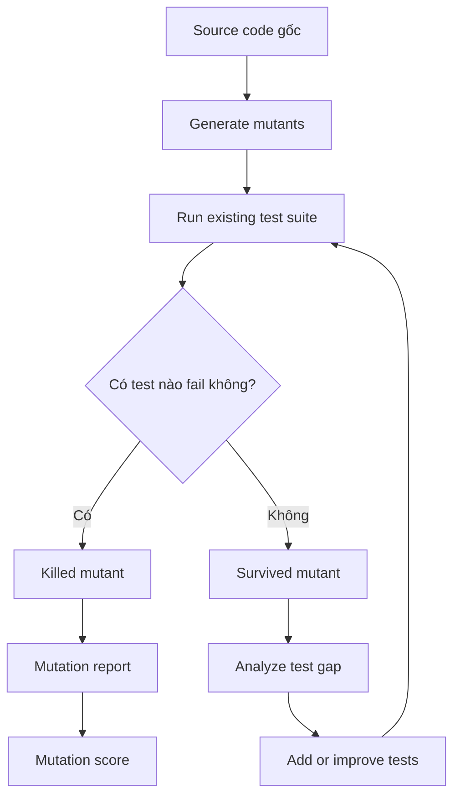

# Quy trình Mutation Testing

## 1. Mục tiêu

Nghiên cứu quy trình của `Mutation Testing`, cụ thể là các bước từ `source code gốc` đến `mutation report`.

Mục tiêu của phần này là làm rõ:

- Mutation testing bắt đầu từ code gốc như thế nào.
- `Mutant` được tạo ra bằng cách nào.
- Test suite được chạy trên từng mutant ra sao.
- Khi nào mutant được xem là `killed`.
- Khi nào mutant được xem là `survived`.
- Mutation report cuối cùng cho biết điều gì về chất lượng test suite.

`Mutation testing` không chủ yếu dùng để tìm bug trực tiếp trong production code. Nó dùng để đánh giá test suite: nếu code bị thay đổi sai mà test vẫn pass, nghĩa là test có thể chưa đủ mạnh.

## 2. Câu hỏi chính

- Các bước từ source code gốc đến mutation report là gì?
- Mutant được tạo ra như thế nào?
- Test được chạy trên các mutant như thế nào?
- Mutant bị killed và survived được xác định như thế nào?

Trả lời ngắn gọn:

Quy trình mutation testing bắt đầu từ `source code gốc`, sau đó mutation tool tạo ra các phiên bản code bị thay đổi nhỏ gọi là `mutants`. Test suite hiện có được chạy trên từng mutant. Nếu có test fail, mutant bị `killed`. Nếu toàn bộ test vẫn pass, mutant `survived`. Kết quả được tổng hợp trong `mutation report`, thường gồm số lượng killed mutants, survived mutants, no coverage mutants, timeout mutants và `mutation score`.

## 3. Ghi chú chính

### 3.1 Ý tưởng cốt lõi

`Mutation testing` là kỹ thuật dùng để đánh giá chất lượng của `test suite`. Tool cố tình chèn các lỗi nhỏ vào `source code gốc`, tạo ra các phiên bản code đã bị thay đổi gọi là `mutants`. Sau đó, test suite hiện có được chạy trên từng mutant.

Nếu có ít nhất một test fail khi mutant được kích hoạt, mutant đó được xem là `killed`. Nếu toàn bộ test vẫn pass, mutant đó `survived`. Trường hợp `survived` thường cho thấy test suite đang thiếu assertion, thiếu test case, hoặc chưa kiểm tra đúng behavior quan trọng.

Theo testRigor, một test suite mạnh nên kill được phần lớn các mutants được cố tình tạo ra. Các `survived mutants` là tín hiệu cho thấy có test gap, hoặc trong một số trường hợp là `equivalent mutants`.

### 3.2 Workflow tổng quát



### 3.3 Giải thích từng bước

| Step | Tên bước | Việc xảy ra | Output |
|---|---|---|---|
| 1 | Chọn `source code gốc` | Chọn phần code quan trọng như business rules, validation logic, security conditions, hoặc core algorithms. | Target code để mutation testing |
| 2 | Generate mutants | Mutation tool áp dụng `mutation operators`, ví dụ đổi operator, negate condition, đổi return value, hoặc remove statement. | Một hoặc nhiều `mutants` |
| 3 | Run existing test suite | Unit tests, integration tests, hoặc end-to-end tests hiện có được chạy trên từng mutant. | Test result cho từng mutant |
| 4 | Phân loại mutant result | Nếu ít nhất một test fail, mutant là `killed`. Nếu toàn bộ test pass, mutant là `survived`. | Killed/survived status |
| 5 | Analyze survivors | Xem xét `survived mutants` để xác định đó là missing test, weak assertion, hay `equivalent mutant`. | Danh sách test gaps |
| 6 | Improve tests | Thêm assertion mạnh hơn, thêm boundary cases, negative cases, hoặc kiểm tra business rule rõ hơn. | Test suite được cải thiện |
| 7 | Re-run mutation testing | Chạy lại mutation testing để kiểm tra mutant trước đó survived đã bị killed chưa. | Mutation report mới |
| 8 | Calculate mutation score | Tính phần trăm mutants bị killed bởi test suite. | `mutation score` |

### 3.4 Mutant được tạo ra như thế nào?

Mutant được tạo ra bằng cách áp dụng `mutation operators` lên code gốc. Một số thay đổi phổ biến:

| Mutation operator | Ví dụ thay đổi |
|---|---|
| Relational operator | `>=` thành `>` |
| Logical operator | `&&` thành `||` |
| Boolean value | `true` thành `false` |
| Return value | `return value` thành `return null` hoặc `return 0` |
| Statement mutation | Xóa một statement hoặc một branch |
| Value mutation | Đổi constant như `0.2` thành `0.05` |

Ví dụ:

```javascript
// Source code gốc
function isAdult(age) {
  return age >= 18;
}

// Mutant
function isAdult(age) {
  return age > 18;
}
```

Nếu test suite có case `age = 18`, mutant này sẽ bị `killed`. Nếu test chỉ kiểm tra `age = 20`, mutant có thể `survived`.

### 3.5 Test được chạy trên mutant như thế nào?

Mutation tool thường chạy test suite hiện có trên từng mutant. Về mặt logic:

1. Tool chạy test trên source code gốc để đảm bảo test suite đang green.
2. Tool kích hoạt một mutant.
3. Tool chạy các test liên quan đến mutant đó.
4. Nếu test fail, mutant bị killed.
5. Nếu test pass hết, mutant survived.
6. Tool lặp lại quá trình này với các mutants khác.

Các tool hiện đại như Stryker hoặc PIT thường tối ưu bằng coverage analysis, tức là chỉ chạy các test có khả năng chạm tới đoạn code bị mutate, thay vì luôn chạy toàn bộ test suite.

### 3.6 Mutation Score

`Mutation score` cho biết test suite hiệu quả như thế nào trong việc phát hiện injected faults.

```text
Mutation score = (number of killed mutants / total number of mutants) * 100
```

Ví dụ:

```text
Killed mutants = 8
Total mutants = 10

Mutation score = (8 / 10) * 100 = 80%
```

Mutation score càng cao thì test suite thường càng mạnh. Tuy nhiên, 100% không phải lúc nào cũng thực tế, vì có thể tồn tại `equivalent mutants`. Đây là các mutants khác về syntax nhưng behavior vẫn giống source code gốc.

### 3.7 Mutation report cho biết điều gì?

| Report finding | Interpretation | Recommended action |
|---|---|---|
| Nhiều killed mutants | Tests có assertion tốt cho các behavior đó. | Giữ tests và theo dõi regression. |
| Survived mutant trong business logic | Code có thể đã được execute nhưng behavior chưa được assert đủ mạnh. | Thêm assertion hoặc missing cases. |
| No coverage mutant | Mutated code không được test nào execute. | Thêm test chạm tới code path đó. |
| Timeout mutant | Mutant có thể tạo infinite loop hoặc làm test chạy quá chậm. | Review loop logic và timeout setting. |
| Equivalent mutant | Mutant behavior giống source code gốc. | Document hoặc exclude cẩn thận. |

### 3.8 Workflow thực tế cho team

1. Bắt đầu với critical code, không cần chạy toàn bộ project ngay.
2. Chạy normal tests trước và đảm bảo test suite đang green.
3. Chạy mutation testing bằng tool như PIT, Stryker, Stryker.NET, hoặc MutPy.
4. Mở mutation report.
5. Ưu tiên xử lý `survived mutants` và `no coverage mutants`.
6. Thêm tests thể hiện missing behavior.
7. Re-run mutation testing.
8. Theo dõi `mutation score` theo thời gian.
9. Dùng incremental mutation testing cho pull requests.
10. Chạy full mutation testing theo lịch, ví dụ nightly hoặc trước release.

## 4. Ví dụ

Luồng từ source code gốc đến mutant `killed`/`survived`.

### 4.1 Source Code Gốc

Giả sử ta có một hàm login đơn giản:

```javascript
function checkCredentials(username, password) {
  if (username === "admin" && password === "password") {
    return true;
  } else {
    return false;
  }
}
```

Expected behavior:

| Input | Expected output |
|---|---|
| username = `"admin"`, password = `"password"` | `true` |
| username = `"wrong"`, password = `"password"` | `false` |
| username = `"admin"`, password = `"wrong"` | `false` |

### 4.2 Existing Test Suite

Giả sử test suite hiện tại chỉ kiểm tra login thành công:

```javascript
test("valid admin credentials should login successfully", () => {
  expect(checkCredentials("admin", "password")).toBe(true);
});
```

Test này có ích, nhưng chỉ kiểm tra valid case. Nó chưa kiểm tra wrong username hoặc wrong password.

### 4.3 Mutant A: Always Return True

Mutation tool có thể tạo mutant sau:

```javascript
function checkCredentials(username, password) {
  return true;
}
```

Chạy existing test suite:

| Test case | Source code gốc result | Mutant result | Test phát hiện khác biệt? |
|---|---:|---:|---|
| `checkCredentials("admin", "password")` | `true` | `true` | Không |

Kết quả:

```text
Mutant A survived
```

Giải thích:

Test suite chỉ kiểm tra successful login path. Vì cả source code gốc và mutant đều return `true` với valid credentials, test vẫn pass. Điều này cho thấy test suite đang thiếu negative test cases.

### 4.4 Cải thiện Test Suite

Thêm test cho invalid credentials:

```javascript
test("wrong username should not login", () => {
  expect(checkCredentials("wrong", "password")).toBe(false);
});

test("wrong password should not login", () => {
  expect(checkCredentials("admin", "wrong")).toBe(false);
});
```

Chạy lại mutation testing.

| Test case | Source code gốc result | Mutant A result | Test phát hiện khác biệt? |
|---|---:|---:|---|
| `checkCredentials("admin", "password")` | `true` | `true` | Không |
| `checkCredentials("wrong", "password")` | `false` | `true` | Có |
| `checkCredentials("admin", "wrong")` | `false` | `true` | Có |

Kết quả:

```text
Mutant A killed
```

Giải thích:

Test suite sau khi cải thiện đã kiểm tra negative login behavior. Mutant luôn return `true`, kể cả khi credentials sai, nên ít nhất một test fail. Vì vậy mutant bị killed.

### 4.5 Mutant B: Đổi AND thành OR

Một mutant khác có thể đổi logical operator:

```javascript
function checkCredentials(username, password) {
  if (username === "admin" || password === "password") {
    return true;
  } else {
    return false;
  }
}
```

Mutant này nguy hiểm vì nó cho phép login khi chỉ một trong hai field đúng.

| Test case | Source code gốc result | Mutant B result | Test phát hiện khác biệt? |
|---|---:|---:|---|
| `checkCredentials("admin", "password")` | `true` | `true` | Không |
| `checkCredentials("wrong", "password")` | `false` | `true` | Có |
| `checkCredentials("admin", "wrong")` | `false` | `true` | Có |

Kết quả:

```text
Mutant B killed
```

Giải thích:

Các negative tests bắt được logic bị thay đổi. Nếu không có những test này, mutant có khả năng sẽ survived.

### 4.6 Mutant C: Equivalent hoặc Irrelevant Case

Đôi khi mutant không làm thay đổi observable behavior. Ví dụ:

```javascript
function checkCredentials(username, password) {
  if ((username === "admin" && password === "password") === true) {
    return true;
  } else {
    return false;
  }
}
```

Phiên bản này nhìn khác code gốc, nhưng trong hầu hết trường hợp bình thường behavior vẫn giống source code gốc.

Kết quả:

```text
Mutant C may be an equivalent mutant
```

Giải thích:

`Equivalent mutant` rất khó hoặc không thể kill vì behavior giống original program. Trường hợp này nên được document hoặc exclude cẩn thận, không nên mặc định xem là test yếu.

### 4.7 Ví dụ Mutation Report

Sau khi chạy mutation testing, tool có thể tạo report như sau:

| Mutant ID | Mutation operator | Code change | Status | Meaning |
|---|---|---|---|---|
| M1 | Return value mutation | Thay login logic bằng `return true` | Killed | Negative tests phát hiện invalid login behavior |
| M2 | Logical operator mutation | Đổi `&&` thành `||` | Killed | Tests phát hiện chỉ một field đúng là chưa đủ |
| M3 | Statement mutation | Remove `else` branch | Killed | Tests phát hiện missing false path |
| M4 | Equivalent mutation | Thêm `=== true` quanh cùng condition | Survived / Equivalent | Behavior gần như không đổi |

Summary:

```text
Total mutants: 4
Killed mutants: 3
Survived mutants: 1
Mutation score: 75%
```

Nếu M4 được xác nhận là `equivalent mutant`, team có thể loại nó khỏi meaningful score:

```text
Meaningful total mutants: 3
Killed mutants: 3
Adjusted mutation score: 100%
```

## 5. Ý chính cần ghi nhớ

- `Mutation testing` kiểm tra chất lượng của test suite.
- Source code gốc được mutate thành các phiên bản lỗi nhỏ gọi là `mutants`.
- `Killed mutant` nghĩa là test suite phát hiện được injected fault.
- `Survived mutant` nghĩa là test suite có thể thiếu assertion hoặc thiếu test case có ý nghĩa.
- `No coverage mutant` nghĩa là mutated code không được test nào execute.
- `Mutation report` cuối cùng cho biết killed, survived, no coverage, timeout, và đôi khi equivalent mutants.
- `Mutation score` tóm tắt mức độ hiệu quả của test suite.
- Mutation score cần được diễn giải cẩn thận vì có thể tồn tại `equivalent mutants` và vì mutation testing có chi phí execution cao hơn normal unit testing.
- Workflow nên được lặp lại: chạy mutation testing, đọc survived mutants, thêm test, rồi chạy lại.

## 6. Tài liệu tham khảo

- [testRigor - Understanding Mutation Testing: A Comprehensive Guide](https://testrigor.com/blog/understanding-mutation-testing-a-comprehensive-guide/)
